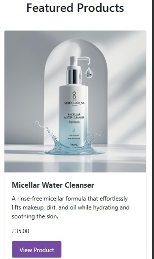
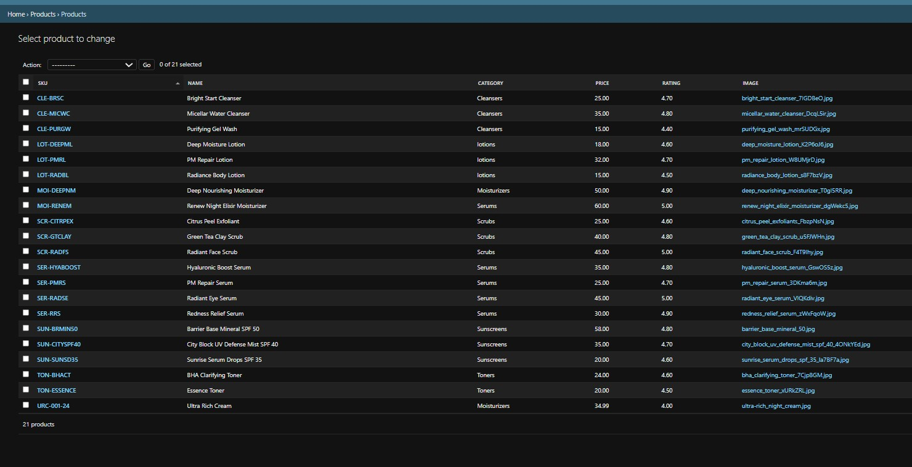
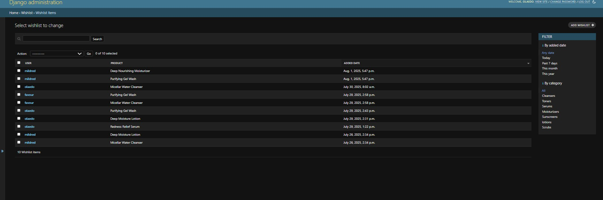

# Skin0clock_ng
 
Your destination for premium skincare products, expert skincare tips, and ingredient-focused education. Discover healthy, radiant skin at any time of day.

We are on a mission to empower people with knowledge and access to high-quality skincare products that promote healthy, glowing skin. Our platform offers a seamless, educational, and rewarding experience where customers can purchase premium skincare products, access expert knowledge, and learn about ingredients that work for their unique skin needs.

Skin0clock_ng is not just a store, it's a community-driven movement toward informed skincare choices, self-care, and the joy of achieving healthy, radiant skin.

Discover the secret of beauty,Let's glow together!

Live Link: https://skin0clock-ng-1fc932a0495c.herokuapp.com/


## Overview

Skin0clock_ng is an e-commerce platform for purchasing premium skincare products with educational content and ingredient-focused guidance. The website offers a seamless shopping experience, with secure Stripe payments, Cloudinary-backed media hosting, and a scalable e-commerce system. Customers can also leave reviews, create wishlists, and access comprehensive FAQ sections.

- [x] A modern & user-friendly e-commerce store for skincare products
- [x] Featured products visible on landing page with links to products
- [x] Comprehensive product categories (Cleansers, Toners, Serums, Moisturizers, Sunscreens, Body Care)
- [x] Product sorting and filtering functionality
- [x] Secure payment processing via Stripe
- [x] Admin product management with CRUD functionality
- [x] Cloudinary for assets & media storage (product images)
- [x] User review system with interactive star ratings
- [x] Wishlist functionality for saved items with real-time updates
- [x] FAQ section for customer support with searchable content
- [x] Contact form for customer inquiries with admin management
- [x] User profile management with order history and delivery preferences
- [x] Order tracking and downloadable confirmations
- [x] Responsive design for all devices
- [x] Custom error pages (404, 403, 500)
- [x] Email verification and password reset functionality

## Web Marketing Strategy

- **Content Marketing**: Skincare education, ingredient guides, routine tips
- **Emailers**: Product launches, skincare tips, seasonal routines
- **Social Media Campaigns**: Product demos, before/after results, ingredient spotlights
- **Referral & Loyalty Programs**: Encourage word of mouth, referral rewards
- **Influencer Collaborations**: Skincare, beauty, wellness niches

## Products & Services

- **Skincare Products**
  - Cleansers, toners, serums, moisturizers, sunscreens, body care
  - Formulated with proven ingredients for various skin concerns
  - Suitable for all skin types and concerns

- **Educational Content**
  - Ingredient guides and skincare education
  - Routine recommendations and expert tips
  - Product reviews and user testimonials

- **Community Support**
  - Access to skincare community and expert advice
  - Personalized recommendations based on skin type

## Target Market

**Primary Audiences:**
- Skincare enthusiasts and beauty lovers
- Health and wellness seekers
- Beginners looking to build a skincare routine
- People with specific skin concerns (acne, aging, sensitivity)
- Clean beauty advocates

**Demographics:**
- Age 18 to 45
- Urban and suburban living
- Health-conscious individuals
- Active on social media and beauty platforms

**Market Problem**
Most skincare products and information available are:
- Overwhelming for beginners
- Lack ingredient education
- Not personalized to individual needs
- Expensive without clear value

**Our Solution:**
- Curated product selection with proven ingredients
- Educational content about ingredients and routines
- Transparent pricing and honest reviews
- Personalized recommendations and support

## SEO Keyword Strategy

Targeted keywords to improve organic traffic & reach the right audience:

- **High intent product keywords:**
  - best skincare products 2025
  - clean beauty products
  - skincare routine for beginners
  - acne treatment products
  - anti-aging skincare
  - sensitive skin products

- **Informational keywords:**
  - how to build a skincare routine
  - skincare ingredients guide
  - what order to apply skincare
  - skincare for different skin types
  - clean beauty vs conventional

- **Category-specific keywords:**
  - best cleansers for acne
  - vitamin C serum benefits
  - mineral sunscreen vs chemical
  - hyaluronic acid moisturizer
  - retinol for beginners


Skin0clock_ng is a premium skincare e-commerce platform that employs a multi-channel marketing strategy focused on education, community building, and customer engagement. It combines traditional and digital tools to reach skincare enthusiasts and beauty-conscious consumers effectively


- **Email Marketing – Mailchimp Newsletter**
  
| **Setup**                  | **Description**                                                                                                                                          |
| -------------------------- | -------------------------------------------------------------------------------------------------------------------------------------------------------- |
| **Newsletter Integration** | Mailchimp form embedded in footer:<br> `https://herokuapp.us10.list-manage.com/subscribe/post?u=f1d7376b0ff8da6ef8a7a3ee8&id=eb2c1e856a&f_id=00a146e4f0` |
| **Audience Building**      | “Subscribe for Healthy Skin” campaign with tagline *"Get skincare tips and exclusive offers right in your inbox"*                                        |
| **Form Fields**            | GDPR-compliant opt-in with honeypot protection                                                                                                           |
| **Automated Responses**    | Mailchimp JS validation for smooth form handling and subscription tracking                                                                               |
| **Content Strategy**       | Focused on skincare education, ingredient guides, tips, and exclusive offers                                                                         


- **Social Media Marketing – Facebook**
  

| **Setup**              | **Description**                                                                                |
| ---------------------- | ---------------------------------------------------------------------------------------------- |
| **Community Building** | Facebook page link in footer: *"Join our skincare community"* with **Skin0clock\_ng** branding |
| **Content Strategy**   | Skincare education, ingredient spotlights, product demos                                       |
| **Target Audience**    | Skincare lovers, health-conscious users aged 18–45                                             |
| **Brand Voice**        | Friendly, educational, trustworthy                                                             |
| **Call-to-Actions**    | “Shop Now” buttons driving traffic to the main website                                         |


- **Content Marketing Strategy**

| **Content Type**        | **Implementation**                                                                                  |
| ----------------------- | --------------------------------------------------------------------------------------------------- |
| **Educational Content** | Homepage features a *"Skincare Tips & Advice"* section (hydration, protection, moisturization tips) |
| **SEO Optimization**    | Meta tags targeting terms like *“skincare products”, “clean beauty”, “acne treatment”*              |
| **Product Education**   | In-depth descriptions with ingredient info and usage guidelines                                     |
| **Expert Resources**    | External links to authority sites (e.g., Healthline Beauty)                                         |


 - **Customer Engagement Features**


 | **Feature**                | **Marketing Purpose**                           |
| -------------------------- | ----------------------------------------------- |
| **Review System**          | Builds trust through social proof               |
| **Wishlist Functionality** | Captures customer interest for retargeting      |
| **User Profiles**          | Enables personalization and email segmentation  |
| **Contact Forms**          | Facilitates direct customer interaction         |
| **FAQ Section**            | Reduces customer service load, builds authority |

- **Technical Marketing Infrastructure**


| **Component**             | **Purpose**                                                                        |
| ------------------------- | ---------------------------------------------------------------------------------- |
| **Email Configuration**   | Gmail SMTP for transactional messages (e.g., order confirmations, password resets) |
| **Social Authentication** | Django Allauth for login via social accounts                                       |
| **SEO Optimization**      | Structured data, robots.txt, sitemap, optimized meta tags                          |
| **Analytics Ready**       | Clean URL structure and analytics-friendly setup                                   |


## Features

### Existing User Features:

Skin0clock_ng is designed for a smooth & informative shopping experience. Below is a breakdown of the features available in this version.

**Key user experience objectives:**
- Immediately communicate the purpose of the site
- Build trust with quality imagery & clear navigation
- Convert new visitors into customers
- Provide educational content about skincare
- Fully responsive layout with tailored experiences for both desktop & mobile users
- Elements scale appropriately, ensuring smooth navigation on all devices

| **Feature** | **Screenshot** |
|:------------|:---------------|
| **Hero Banner Desktop**  
The landing page acts as the main entry point to the Skin0clock_ng site, featuring a full-width hero image that builds trust, communicates the brand's purpose & guides visitors toward shopping or learning. A 'Shop Now' CTA encourages engagement, supported by a responsive layout optimized for desktop browsing. |  |
| **Hero Banner Mobile**  
The mobile landing page adapts the hero banner for smaller screens without losing impact, ensuring fast loading, touch-friendly navigation & clear CTA visibility. It maintains the brand's core goals while delivering a smooth, fully responsive user journey on mobile devices. |  |
| **Navigation Bar**  
Primary navigation bar offering intuitive access to key site areas, including Products, FAQ, Contact, Shopping Bag & User Profile. |  |
| **Navigation Bar Mobile**  
Responsive hamburger menu ensuring smooth navigation on smartphones & tablets. |  |
| **Featured Products Section**  
Highlighted skincare products selected by category, encouraging users to explore premium products easily from the homepage. |  |
| **Featured Products Section Mobile**  
A clean, responsive featured section for mobile users, maintaining focus on special products. |  |
| **Skincare Tips & Advice**  
A clean, responsive featured section for mobile users, maintaining focus on special products. |  |
| **Skincare Tips & Advice Mobile**  
A clean, responsive featured section for mobile users, maintaining focus on special products. |  |
| **Footer**  
A consistent footer across all pages, featuring external SEO links, social media integration & an accessible scroll-to-top button. |  |
| **Footer Mobile**  
Mobile-optimized footer maintaining usability, visibility & accessibility compliance. |  |
| **Product Detail**  
Detailed single-product page offering pricing, description, stock availability & direct add-to-cart functionality. |  |
| **Product Listings Mobile**  
Responsive mobile-friendly product grid to ensure seamless shopping on small devices. |  |
| **Product Detail Mobile**  
Optimized mobile view of product details with easy add-to-cart access & product descriptions. |  |
| **FAQ Page**  
Informational page providing detailed answers to common skincare questions and customer support. |  |
| **FAQ Mobile**  
Streamlined, mobile-friendly version of the FAQ for easy reference on smaller screens. |  |
| **Shopping Bag**  
Session-based shopping bag allowing users to adjust quantities, remove items, or proceed to checkout with real-time updates. |  |
| **Add to Bag Alert**  
Modal popup confirming that a product has been successfully added to the bag. |  |
| **Delete from Bag Alert**  
Alert message confirming an item's removal from the bag. |  |
| **Update Bag Alert**  
Real-time notification after changing item quantities within the shopping bag. |  |
| **Checkout Desktop**  
Secure checkout flow integrated with Stripe, displaying billing, delivery details & an order summary. |  |
| **Shopping Bag Mobile**  
Mobile-optimized shopping bag allowing easy quantity adjustment & checkout progression. |  |
| **Checkout Mobile**  
Streamlined Stripe checkout experience designed for mobile users. |  |
| **Signup Page**  
New user registration form requesting username, email & password. |  |
| **Email Verification Prompt**  
Instruction page guiding new users to verify their email addresses. |  |
| **Email Confirmation Success**  
Confirmation message once a user's email address has been successfully verified. |  |
| **Login Page**  
User login form for account access using username & password. |  |
| **Password Reset Request**  
Password reset form allowing users to recover accounts securely. |  |
| **Order History**  
Account section showing users a summary of previous orders. |  |
| **Profile Page**  
Profile management page where users can update personal details & delivery addresses. |  |
| **Contact Form**  
Dedicated contact page for inquiries, product support, or general questions submitted to admin. |  |
| **Contact Form Confirmation**  
Success message shown to users after submitting the contact form. |  |
| **Error Pages**  
Custom-designed 404 error page guiding users back to the homepage if they reach a broken link. |  |
| **Wishlist Page**  
Personal wishlist page where logged-in users can view all their saved products with options to view details or remove items. |  |
| **Wishlist Button**  
Interactive wishlist buttons on product pages allowing users to add/remove items from their wishlist with real-time feedback. |  |
| **Review System**  
Star rating system allowing users to leave detailed reviews for products they've purchased, with interactive star rating widget. |  |
| **Newsletter Subscription**  
Mailchimp subscription form allowing users to opt-in for marketing emails, with GDPR-compliant consent. |  |
| **Newsletter Confirmation Page**  
Success page confirming that the subscription to the newsletter was completed. |  |
| **Newsletter Success Alert**  
Visual confirmation message appearing after a successful newsletter signup. |  |
| **Product Reviews Display**  
Product detail pages show all user reviews with star ratings, helping customers make informed purchasing decisions. |  ||
| **Category Filtering**  
Product filtering by categories (Cleansers, Toners, Serums, etc.) with dropdown navigation for easy product discovery. |  |
| **Product Sorting**  
Advanced product sorting options by price, (low to high, high to low) and rating to help users find products that match their preferences. |  |

### Existing Admin Features

Admin users can manage the entire ecosystem of products, reviews, & customer interactions through both the Django admin panel & the site interface. The system is designed for efficient backend management while also offering fast frontend editing tools for ease of use.

**Key Administrative Objectives:**
- Enable full CRUD (Create, Read, Update, Delete) control over products, reviews & users
- Allow dynamic content management, including FAQ updates without code changes
- Provide quick-access frontend management tools for products
- Monitor stock levels through visual indicators
- Prevent out-of-stock sales proactively
- Streamline order fulfillment processes & customer communications
- Maintain full control over user profiles & submitted customer inquiries

| **Feature** | **Screenshot** |
|:------------|:---------------|
| **Admin Panel Overview**  
The Django admin dashboard provides secure, streamlined access to manage products, reviews, orders, users & site content. Admins can perform all key actions through an intuitive interface without needing direct access to the database or codebase. |  |
| **Product Management via Admin**  
Admins can easily create, update, or delete skincare products directly through the admin interface, keeping the shop inventory dynamic & up-to-date. |  |
| **FAQ Content Management**  
FAQ resources can be easily expanded by admins without coding, allowing new questions, answers & categories to be added dynamically through the CMS. |  |
| **Review Content Management**  
FAQ resources can be easily expanded by admins without coding, allowing new questions, answers & categories to be added dynamically through the CMS. |  |
| **Wishlist Content Management**  
FAQ resources can be easily expanded by admins without coding, allowing new questions, answers & categories to be added dynamically through the CMS. |  |
| **Admin Links in Navbar**  
Admin users have quick frontend access to manage products via special links visible only when logged in with superuser privileges. |  |
| **Manage Products via Site Interface**  
For fast updates, admins can modify existing products or add new items directly through the site frontend without using the admin backend. |  |
| **Order Management**  
Admins can review all placed orders including customer details, line items, timestamps & payment status, providing full control over order processing & fulfillment. |  |

### Future Features:

The following features are planned for possible future development to enhance user experience, boost engagement & scale website functionality:

| **Feature** | **Details** |
|:------------|:------------|
| **Skincare Routine Builder** (Personalized routine recommendations) | (1) Quiz to determine skin type and concerns<br>(2) AI-powered product recommendations<br>(3) Custom routine creation and tracking |
| **Subscription Model** (Create recurring sales & convenience for users) | (1) Monthly skincare box subscriptions<br>(2) Auto-renew with Stripe integration<br>(3) Personalized product selection |
| **Virtual Try-On** (AR technology for product testing) | (1) Virtual skin analysis<br>(2) Before/after simulation<br>(3) Product compatibility testing |
| **Community Features** (Build user engagement and trust) | (1) User-generated content and reviews<br>(2) Skincare challenges and routines<br>(3) Expert Q&A sessions |
| **Loyalty Program** (Incentivize repeat purchases) | (1) Points for purchases, reviews, referrals<br>(2) Tier-based rewards system<br>(3) Exclusive access to new products |
| **Mobile App** (Enhanced mobile experience) | (1) Native iOS and Android apps<br>(2) Push notifications for deals<br>(3) Barcode scanning for product info |
| **Live Chat Support** (Real-time customer service) | (1) AI-powered chat support<br>(2) Human expert consultation<br>(3) Product recommendation chat |
| **Ingredient Database** (Educational content) | (1) Comprehensive ingredient library<br>(2) Safety and efficacy ratings<br>(3) Ingredient interaction warnings |
| **Personalized Email Campaigns** (Targeted marketing) | (1) Behavior-based email sequences<br>(2) Abandoned cart recovery<br>(3) Product recommendation emails |


## Agile Development

### Agile Workflow

An Agile development process was followed using GitHub Projects for sprint planning, user story tracking & task issue management. New user stories have been added as the project progressed & based on user feedback during the final testing phase.

### Project Issues


### Project Milestones


### MoSCoW Prioritisation:

- **Must Have:** Essential for MVP & launch 
- **Should Have:** Important but not critical for MVP
- **Could Have:** Enhancements added in later sprints
- **Won’t Have:** Out of current scope

See agile [project boards here](https://github.com/users/mildred-prog/projects/11/views/9)


## User Stories

User stories were used to keep track of the MOSCOW framework & project MVP as working through the project. 


### Complete User Stories List:

#### Core Infrastructure & Setup
- [x] **Create Django app** - Set up the main Django application structure
- [x] **Create PostgreSQL database** - Configure database for production deployment
- [x] **Create product images** - Add comprehensive product image library
- [x] **Integrate Stripe for payment** - Implement secure payment processing
- [x] **Create a Hosting service for deployment** - Set up Heroku deployment with AWS S3
- [x] **Create item JSON file** - Add product and category fixtures

#### User Interface & Experience
- [x] **Homepage** - Create engaging landing page with featured products
- [x] **Viewing skincare products** - Display product catalog with filtering
- [x] **View products details individually** - Detailed product pages with images and descriptions
- [x] **Persistent access to shopping basket** - Session-based shopping cart functionality
- [x] **404 page not found** - Custom error page for broken links
- [x] **505 page-Internal server error** - Custom error page for server issues

#### User Authentication & Account Management
- [x] **Create Account** - User registration with email verification
- [x] **Login & logout of account** - Secure authentication system
- [x] **Manage User Account** - Admin panel for user management
- [x] **Have a personalized profile** - User profile with order history and preferences

#### Product Discovery & Management
- [x] **Product search** - Search functionality for finding products
- [x] **Sort products** - Sort by price, rating, and other criteria
- [x] **Filter products** - Filter by category, price range, and other attributes
- [x] **Add a product** - Admin functionality to add new products
- [x] **Edit products** - Admin functionality to modify existing products
- [x] **Delete product** - Admin functionality to remove products

#### Shopping Cart & Checkout
- [x] **Add Product to Shopping Cart** - Add items to cart with quantity selection
- [x] **Update Products in Cart** - Modify quantities and remove items
- [x] **Order Summary display** - Review order before checkout
- [x] **Order confirmation** - Email confirmation and order tracking

#### Customer Support & Communication
- [x] **Contact Us** - Contact form for customer inquiries
- [x] **Subscribe to newsletter** - Email newsletter subscription
- [x] **Create FAQ Model** - FAQ system for customer support
- [x] **Store owner page** - Admin dashboard for store management

#### Advanced Features
- [x] **Create Product Review Model** - User review and rating system
- [x] **Create a Wishlist Model** - Save products for later purchase
- [x] **Routine Planner** - Skincare routine planning functionality
- [x] **Optimize with SEO** - Search engine optimization
- [x] **Marketing** - Marketing strategies and campaigns

| **USER STORY** | **DETAILS** | **ACCEPTANCE CRITERIA** |
| -------------- | ----------- | ----------------------- |
| **Register an account** | As a User / Admin, I want to register an account so that I can create a personal profile | (1) User/Admin can create an account with a username, email & password. (2) User/Admin receives a confirmation email upon successful registration. |
| **Login & logout of account** | As a User / Admin, I want to log in & log out my account so that I can keep my profile secure | (1) User/Admin can log in using their username/email & password. (2) A "Remember Me" option is available for convenience. (3) Users/Admin can log in / out at any time via site header. |
| **Manage user accounts** | As an Admin, I want to access user profiles from admin panel so that I can manage user accounts | (1) Admins can view, activate & deactivate user accounts. (2) Admins can manually reset user passwords if needed. |
| **Browse products** | As a User, I want to view available skincare products so that I can decide before making purchase | (1) Products are displayed with images, descriptions, prices & quantity panel. (2) Products are categorized by type (cleansers, toners, serums, etc.). |
| **Detailed product view** | As a User, I want to view a product details so that I can see in depth details before making purchase | (1) Clicking a product opens a detailed page with full descriptions, stock levels & images. (2) If the item is out of stock, an automated message is displayed. |
| **Add featured items** | As a User, I want to view featured products on the homepage so that I can discover new products easily | (1) Featured products are displayed prominently on the homepage. (2) Each category has a featured product with clear call-to-action. |
| **Add to shopping cart** | As a User, I want to add items to my shopping cart so that I can continue browsing | (1) User can add multiple products to their cart. (2) The cart updates dynamically with quantity & total price. |
| **Update items in cart** | As a User, I want to update my shopping cart so that I can add or remove items | (1) User can increase / decrease item quantity. (2) User can remove items from the cart before checkout. |
| **Secure card payment checkout** | As a User, I want to securely pay for my order so that I can place order effortlessly | (1) User enters shipping details. (2) Card payment is processed via Stripe securely. (3) A confirmation email is sent upon successful payment. (4) Error messages if card payment is not successful, prompting user. (5) Order not processed if declined, keep order payment pending. |
| **Order summary display** | As a User, I want to see an order summary so that I can review items before completing checkout | (1) User can review products, quantities & final prices before payment. |
| **Order management** | As an Admin, I want to see successful orders in admin panel so that I can manage customer orders | (1) Orders appear in the Admin panel. (2) Admin can update order status (Pending, Shipped, Delivered). (3) Admin can search & sort orders by date, status & user. |
| **Successful order email** | As a User, I want to receive a confirmation email after purchase so that I can see my order has been placed successfully | (1) An email is automatically sent to user with order confirmation. |
| **Product management** | As an Admin, I want to add, edit & delete items so that I can edit & add new products easily | (1) Admin can add, edit & delete products via the Admin dashboard. (2) Admin can add, edit & delete products directly on site when logged in as an admin. |
| **Write a review** | As a User, I want to write reviews for products so that I can share my experience with others | (1) Logged-in users can leave reviews with interactive star ratings (1-5 stars). (2) Reviews are displayed on product detail pages with star ratings and comments. (3) Users can only review products they've purchased. (4) Review form includes both rating and detailed comment fields. |
| **Add items to wishlist** | As a User, I want to add products to my wishlist so that I can save items for later | (1) Logged-in users can add products to a personal wishlist with real-time feedback. (2) Wishlist is accessible from the navigation menu and user's account dashboard. (3) Users can view, manage, and remove items from their wishlist. (4) Interactive wishlist buttons show current status (added/not added). |
| **FAQ for questions** | As a User, I want to access FAQ information so that I can find answers to common questions | (1) FAQ page with categorized questions and answers. (2) Search functionality for finding specific information. |
| **Social media profile** | As a User, I want to follow Skin0clock_ng on social media so that I can stay updated | (1) User can access social media profiles via footer links. (2) Social profiles contain brand updates and skincare tips. |
| **Optimize with Google SEO** | As a Developer, I want the website to be optimised for Google SEO so that the site can be found when users search for skincare products | (1) Meta tags are correctly structured for SEO. (2) Sitemap and robots.txt are properly configured. |
| **User logged in for checkout** | I want users to be logged into their profile before proceeding with checkout so that they can have their orders linked & traced back to their profiles | (1) If user is logged in already: CTA on bag view directs user to checkout page with delivery details & Stripe payment option. (2) If user is not logged in: User is directed to login / register page. (3) Once user is successfully logged in, they are redirected back to checkout view to place order successfully. |
| **Filter products by category** | As a User, I want to filter products by category so that I can find products for my specific skincare needs | (1) Dropdown navigation with all product categories (Cleansers, Toners, Serums, etc.). (2) Category filtering shows only products in selected category. (3) Easy navigation between different product types. |
| **Sort products by price and rating** | As a User, I want to sort products by price and rating so that I can find the best products within my budget | (1) Sort products by price (low to high, high to low). (2) Sort products by rating (highest rated first). (3) Clear sorting options in navigation dropdown. |

## Site Testing

Please see [TESTING.md](TESTING.md) document.

## UX/UI Wireframing


### Wireframe


## Page Layout Wireframes

### 🏠 **Home Page Layout**
```
┌─────────────────────────────────────────────────────────────┐
│ 🔝 Header: Logo | Navigation | Search | Account | Bag     │
├─────────────────────────────────────────────────────────────┤
│                                                             │
│  🎯 Hero Section                                          │
│  ┌─────────────────────────────────────────────────────┐   │
│  │ "Discover The Secrets Of Beauty"                   │   │
│  │ [Shop Now Button]                                  │   │
│  └─────────────────────────────────────────────────────┘   │
│                                                             │
│  🛍️ Featured Products                                    │
│  ┌─────────────┐ ┌─────────────┐ ┌─────────────┐        │
│  │ Product 1   │ │ Product 2   │ │ Product 3   │        │
│  │ [Image]     │ │ [Image]     │ │ [Image]     │        │
│  │ Name        │ │ Name        │ │ Name        │        │
│  │ £Price      │ │ £Price      │ │ £Price      │        │
│  │ [View]      │ │ [View]      │ │ [View]      │        │
│  └─────────────┘ └─────────────┘ └─────────────┘        │
│                                                             │
│  💡 Skincare Tips & Advice                                │
│  ┌─────────────┐ ┌─────────────┐ ┌─────────────┐        │
│  │ Stay        │ │ Soothe &     │ │ Moisturize  │        │
│  │ Hydrated    │ │ Protect      │ │ Daily       │        │
│  │ [Image]     │ │ [Image]      │ │ [Image]     │        │
│  └─────────────┘ └─────────────┘ └─────────────┘        │
│                                                             │
│ 🔽 Footer: Company Info | Social Links | Contact          │
└─────────────────────────────────────────────────────────────┘
```

### 🛍️ **Products Page Layout**
```
┌─────────────────────────────────────────────────────────────┐
│ 🔝 Header: Logo | Navigation | Search | Account | Bag     │
├─────────────────────────────────────────────────────────────┤
│                                                             │
│  🏷️ Categories Dropdown: [Cleansers|Toners|Serums|...]   │
│  🔍 Sort Options: [Price|Rating|Name] [Asc|Desc]          │
│                                                             │
│  📦 Product Grid (3-4 columns)                            │
│  ┌─────────────┐ ┌─────────────┐ ┌─────────────┐        │
│  │ Product 1   │ │ Product 2   │ │ Product 3   │        │
│  │ [Image]     │ │ [Image]     │ │ [Image]     │        │
│  │ Name        │ │ Name        │ │ Name        │        │
│  │ ⭐⭐⭐⭐⭐    │ │ ⭐⭐⭐⭐     │ │ ⭐⭐⭐⭐⭐    │        │
│  │ £Price      │ │ £Price      │ │ £Price      │        │
│  │ [Add to Bag]│ │ [Add to Bag]│ │ [Add to Bag]│        │
│  └─────────────┘ └─────────────┘ └─────────────┘        │
│  ┌─────────────┐ ┌─────────────┐ ┌─────────────┐        │
│  │ Product 4   │ │ Product 5   │ │ Product 6   │        │
│  │ [Image]     │ │ [Image]     │ │ [Image]     │        │
│  │ Name        │ │ Name        │ │ Name        │        │
│  │ ⭐⭐⭐⭐     │ │ ⭐⭐⭐⭐⭐    │ │ ⭐⭐⭐⭐     │        │
│  │ £Price      │ │ £Price      │ │ £Price      │        │
│  │ [Add to Bag]│ │ [Add to Bag]│ │ [Add to Bag]│        │
│  └─────────────┘ └─────────────┘ └─────────────┘        │
│                                                             │
│  📄 Pagination: [1] [2] [3] [Next]                       │
│                                                             │
│ 🔽 Footer: Company Info | Social Links | Contact          │
└─────────────────────────────────────────────────────────────┘
```

### 📦 **Product Detail Page Layout**
```
┌─────────────────────────────────────────────────────────────┐
│ 🔝 Header: Logo | Navigation | Search | Account | Bag     │
├─────────────────────────────────────────────────────────────┤
│                                                             │
│  🏠 Breadcrumb: Home > Products > Product Name            │
│                                                             │
│  📦 Product Details (2-column layout)                     │
│  ┌─────────────────────┐ ┌─────────────────────────────┐  │
│  │                     │ │ Product Name                │  │
│  │    [Product Image]  │ │ ⭐⭐⭐⭐⭐ (5 reviews)        │  │
│  │                     │ │ £Price                      │  │
│  │                     │ │                             │  │
│  │                     │ │ Description:                │  │
│  │                     │ │ [Product description text]  │  │
│  │                     │ │                             │  │
│  │                     │ │ Quantity: [1] [+][-]        │  │
│  │                     │ │ [Add to Bag] [❤️ Wishlist]  │  │
│  └─────────────────────┘ └─────────────────────────────┘  │
│                                                             │
│  ⭐ Customer Reviews                                      │
│  ┌─────────────────────────────────────────────────────┐   │
│  │ Review 1: ⭐⭐⭐⭐⭐ "Great product!" - User1        │   │
│  │ Review 2: ⭐⭐⭐⭐  "Good quality" - User2          │   │
│  │ [Add Review] [View All Reviews]                    │   │
│  └─────────────────────────────────────────────────────┘   │
│                                                             │
│ 🔽 Footer: Company Info | Social Links | Contact          │
└─────────────────────────────────────────────────────────────┘
```

### 🛒 **Shopping Bag Page Layout**
```
┌─────────────────────────────────────────────────────────────┐
│ 🔝 Header: Logo | Navigation | Search | Account | Bag     │
├─────────────────────────────────────────────────────────────┤
│                                                             │
│  🛒 Shopping Bag                                          │
│  ┌─────────────────────────────────────────────────────┐   │
│  │ Product 1                    │ Qty: [2] [+][-]    │   │
│  │ [Image] Name                 │ £Price             │   │
│  │ ⭐⭐⭐⭐⭐                     │ [Remove]            │   │
│  ├─────────────────────────────────────────────────────┤   │
│  │ Product 2                    │ Qty: [1] [+][-]    │   │
│  │ [Image] Name                 │ £Price             │   │
│  │ ⭐⭐⭐⭐                      │ [Remove]            │   │
│  ├─────────────────────────────────────────────────────┤   │
│  │                             │ Subtotal: £XX.XX   │   │
│  │                             │ Delivery: £X.XX    │   │
│  │                             │ Total: £XX.XX      │   │
│  │                             │                     │   │
│  │ [Continue Shopping]          │ [Secure Checkout]  │   │
│  └─────────────────────────────────────────────────────┘   │
│                                                             │
│ 🔽 Footer: Company Info | Social Links | Contact          │
└─────────────────────────────────────────────────────────────┘
```

### 💳 **Checkout Page Layout**
```
┌─────────────────────────────────────────────────────────────┐
│ 🔝 Header: Logo | Navigation | Search | Account | Bag     │
├─────────────────────────────────────────────────────────────┤
│                                                             │
│  💳 Checkout (2-column layout)                            │
│  ┌─────────────────────────────┐ ┌─────────────────────┐  │
│  │ Delivery Information        │ │ Order Summary        │  │
│  │ ┌─────────────────────────┐ │ │ ┌─────────────────┐ │  │
│  │ │ Full Name: [Input]      │ │ │ │ Product 1 x2     │ │  │
│  │ │ Email: [Input]          │ │ │ │ Product 2 x1     │ │  │
│  │ │ Phone: [Input]          │ │ │ │                   │ │  │
│  │ │ Country: [Dropdown]     │ │ │ │ Subtotal: £XX.XX │ │  │
│  │ │ Postcode: [Input]       │ │ │ │ Delivery: £X.XX  │ │  │
│  │ │ Town/City: [Input]      │ │ │ │ Total: £XX.XX    │ │  │
│  │ │ Street Address: [Input] │ │ │ └─────────────────┘ │  │
│  │ └─────────────────────────┘ │ │                     │  │
│  │                             │ │ Payment:            │  │
│  │ Payment Information         │ │ [Stripe Card Input] │  │
│  │ ┌─────────────────────────┐ │ │                     │  │
│  │ │ Card Number: [Input]    │ │ │ [Complete Order]   │  │
│  │ │ Expiry: [MM/YY]        │ │ │                     │  │
│  │ │ CVC: [Input]           │ │ │                     │  │
│  │ └─────────────────────────┘ │ │                     │  │
│  └─────────────────────────────┘ └─────────────────────┘  │
│                                                             │
│ 🔽 Footer: Company Info | Social Links | Contact          │
└─────────────────────────────────────────────────────────────┘
```

### 👤 **User Profile Page Layout**
```
┌─────────────────────────────────────────────────────────────┐
│ 🔝 Header: Logo | Navigation | Search | Account | Bag     │
├─────────────────────────────────────────────────────────────┤
│                                                             │
│  👤 My Profile (Tabbed layout)                            │
│  ┌─────────────────────────────────────────────────────┐   │
│  │ [Profile Info] [Order History] [Wishlist]         │   │
│  ├─────────────────────────────────────────────────────┤   │
│  │                                                 │   │
│  │ Profile Information                              │   │
│  │ ┌─────────────────────────────────────────────┐   │   │
│  │ │ Username: [Display]                        │   │   │
│  │ │ Email: [Display]                           │   │   │
│  │ │                                             │   │   │
│  │ │ Default Delivery Information:               │   │   │
│  │ │ Phone: [Input]                             │   │   │
│  │ │ Street Address: [Input]                    │   │   │
│  │ │ Town/City: [Input]                         │   │   │
│  │ │ Postcode: [Input]                          │   │   │
│  │ │ Country: [Dropdown]                        │   │   │
│  │ │                                             │   │   │
│  │ │ [Update Information]                        │   │   │
│  │ └─────────────────────────────────────────────┘   │   │
│  │                                                 │   │
│  └─────────────────────────────────────────────────────┘   │
│                                                             │
│ 🔽 Footer: Company Info | Social Links | Contact          │
└─────────────────────────────────────────────────────────────┘
```

### Brand Color Palette

Skin0clock_ng's visual identity is designed to reflect elegance, clarity, and vibrant self-care energy. Each color plays a purposeful role in enhancing the user experience and brand perception.

| **Color**  | **Hex Code** | **Purpose & Description**                                                                                                                                                 |
| ---------- | ------------ | ------------------------------------------------------------------------------------------------------------------------------------------------------------------------- |
| **Purple** | `#764ba2`    | **Signature Brand Color** — A bold, luxurious purple that evokes calm, trust, and beauty. It's the foundation of our brand identity and adds a modern edge to the design. |
| **Black**  | `#000000`    | **Primary Text & Structure** — Used for headings, body text, and structural elements to ensure strong contrast and legibility throughout the site.                        |
| **White**  | `#ffffff`    | **Clean Backgrounds** — Offers simplicity and cleanliness, allowing products and messages to stand out with clarity and elegance.                                         |
                                 


## Technologies Used

### Languages

**Application Structure**

| **Frontend** |    |
|:-------------|:---|
| **HTML** | Provides the main content & structure of the site. |
| **CSS** | Defines the styling, layout & visual presentation of the site. |
| **JavaScript** | Enables user interactions & dynamic behaviour on the frontend. |
| **Bootstrap** | CSS framework used for responsive design & pre-built UI components. |
| **Crispy Forms** | Formats Django forms to use Bootstrap styles for a consistent look. |

| **Backend** |    |
|:------------|:---|
| **Python** | Core backend programming language powering the application logic. |
| **Django** | High-level Python web framework used for rapid backend development. |
| **PostgreSQL** | Relational database management system for storing application data. |
| **psycopg2** | PostgreSQL adapter allowing Django to interact with the PostgreSQL database. |
| **Stripe** | Secure payment gateway integrated for processing orders. |
| **Django Allauth** | Library handling user authentication, registration, login & email verification. |
| **Pillow** | Python library used for image uploading & processing for products. |

| **Development Tools:** |    |
|:-----------------------|:---|
| **Git** | Version control system used for tracking changes in the project (`git add`, `git commit`, `git push`). |
| **GitHub** | Remote code repository & collaboration platform for version control & backups. |
| **VS Code** | Integrated Development Environment (IDE) used for coding, debugging & project management. |

| **Hosting & Deployment:** |    |
|:--------------------------|:---|
| **Heroku** | Cloud platform used for hosting & deploying the Django web application. |
| **AWS S3** | Amazon Web Services storage service used for hosting static & media files.. |
| **Gunicorn** | WSGI HTTP server used to run Django apps in a production environment. |

### Libraries & Frameworks

The following libraries & frameworks were used to enhance functionality, improve user experience & support deployment:

- **Backend & Django:**
  - `Django` – Core web framework
  - `django-allauth` – User authentication, registration & social login
  - `django-crispy-forms` – Bootstrap styled form rendering
  - `django-storages` – Cloudinary integration for static / media file storage
  - `dj-database-url` – Simplifies database configuration for Heroku
  - `whitenoise` – Serves static files in production
  - `gunicorn` – WSGI server for deployment
  - `pillow` – Image handling for uploaded content

- **Frontend:**
  - `Bootstrap` (via CDN) – Responsive front-end framework
  - `jQuery` (via CDN) – DOM manipulation & cart interactivity

- **Payment Integration:**
  - `stripe` – Secure online payments
  - `PyJWT` – Token-based authentication (used by Stripe & others)

- **Cloud Storage:**
  - `AWS S3` – Amazon Web Services storage service used for hosting static & media files.

- **Database:**
  - `psycopg2-binary` – PostgreSQL driver
  - `sqlparse` – SQL formatting for Django migrations

- **Security & Email:**
  - `cryptography`, `cffi`, `pycparser` – Secure cryptographic operations
  - `requests`, `requests-oauthlib` – Secure API / OAuth integrations
  - `python3-openid`, `oauthlib` – Social login support
  - `defusedxml` – XML security

- **Utilities & Linting:**
  - `flake8`, `pyflakes`, `pycodestyle`, `mccabe` – Code quality checks
  - `setuptools`, `typing_extensions` – Development utilities & type hinting support

## Solution Model

**Primary Models:**

| **Model** | **Description** |
|:----------|:----------------|
| **UserProfile** | Stores customer details linked to Django's built-in User model. |
| **Product** | Represents skincare products available for purchase. |
| **Category** | Organizes products into categories (Cleansers, Toners, Serums, etc.). |
| **Order** | Stores information about product purchases by users. |
| **OrderLineItem** | Individual items within an order with quantity and pricing. |
| **Review** | User reviews and ratings for products. |
| **Wishlist** | Saved products for future purchase consideration. |
| **FAQ** | Frequently asked questions and answers for customer support. |
| **Cart** | Handles session-based shopping cart items before checkout. |
| **Payment** | Processes transactions securely using Stripe integration. |

### ERD & Database Design

**Product**
- id (AutoField, Primary Key)
- name (CharField)
- sku (CharField, Unique)
- description (TextField)
- price (DecimalField)
- category (ForeignKey to Category)
- rating (DecimalField)
- image_url (URLField)
- image (ImageField)

**Category**
- id (AutoField, Primary Key)
- name (CharField, Unique)

**Review**
- id (AutoField, Primary Key)
- product (ForeignKey to Product)
- user (ForeignKey to User)
- rating (PositiveSmallIntegerField)
- comment (TextField)
- date_posted (DateTimeField)

**Wishlist**
- id (AutoField, Primary Key)
- user (ForeignKey to User)
- product (ForeignKey to Product)
- added_date (DateTimeField)

**Order**
- id (AutoField, Primary Key)
- order_number (CharField, Unique)
- user_profile (ForeignKey to UserProfile)
- full_name (CharField)
- email (EmailField)
- phone_number (CharField)
- country (CountryField)
- postcode (CharField)
- town_or_city (CharField)
- street_address1 (CharField)
- street_address2 (CharField)
- county (CharField)
- date (DateTimeField)
- delivery_cost (DecimalField)
- order_total (DecimalField)
- grand_total (DecimalField)
- original_bag (TextField)
- stripe_pid (CharField)

A detailed first look at ERD & database models below:


## Django Project Setup

##### (1) Install Django & Supporting Libraries
```bash
pip install 'django<4' gunicorn
pip install dj_database_url psycopg2
```

Once the relevant dependencies are installed, generate a `requirements.txt` file to track them:

```bash
pip freeze --local > requirements.txt
```

##### (2) Create Your Django Project & App
```bash
django-admin startproject skin0clock_ng .
python manage.py startapp home
```

Add your new app to `INSTALLED_APPS` in `settings.py`:

```python
'home',
```

##### (3) Create a Superuser
To enable admin access:

```bash
python manage.py createsuperuser
```

##### (4) Run Migrations
```bash
python manage.py migrate
```

##### (5) Set Up Environment Variables
Create an `env.py` file to store sensitive information like `DATABASE_URL` & `SECRET_KEY`.

```python
import os

os.environ["DATABASE_URL"] = "<copiedURLfromPostgres/SQLite>"
os.environ["SECRET_KEY"] = "my_super^secret@key"
```

Add `env.py` to your `.gitignore` to keep it out of version control.
##### (6) Update `settings.py` to Use Environment Variables

```python
import os
import dj_database_url

if os.path.exists("env.py"):
    import env

SECRET_KEY = os.environ.get('SECRET_KEY')

DATABASES = {
    'default': dj_database_url.parse(os.environ.get("DATABASE_URL"))
}
```

##### (7) Set Up the Templates Directory
In `settings.py`, add:

```python
TEMPLATES_DIR = os.path.join(BASE_DIR, 'templates')
```

Update the `DIRS` section of `TEMPLATES`:

```python
'DIRS': [
    os.path.join(BASE_DIR, 'templates'),
    os.path.join(BASE_DIR, 'templates', 'allauth'),
],
```

##### (8) Create Media, Static & Templates Directories
Inside the top-level project directory (same level as `manage.py`), create:

- `media/`
- `static/`
- `templates/`

##### (9) Prepare for Heroku Deployment
Create a `Procfile` in the root of your project & add:

```
web: gunicorn skin0clock-ng.wsgi
```

##### (10) Finalize Setup
Make any necessary migrations:

```bash
python manage.py migrate
```


## Deployment

### AWS Cloud Service
**Amazon Web Services (AWS)** used to store 1up GrowKits' static & media files securely, for fast & reliable access.


#### Steps to Set Up AWS:

##### (1) Create & Configure an S3 Bucket
- **Login** to your AWS Management Console
- Go to **S3** & create a new bucket with a globally unique name
- Choose a region closest to your user base

**Public Access & Ownership:**
- Uncheck "Block all public access"
- Under Object Ownership, select "ACLs enabled" & "Bucket owner preferred"

**Enable Static Website Hosting:**
- In the "Properties" tab, enable static website hosting
- Set `index.html` & `error.html` as the default documents

**CORS Configuration:**
```json
[
  {
    "AllowedHeaders": ["Authorization"],
    "AllowedMethods": ["GET"],
    "AllowedOrigins": ["*"],
    "ExposeHeaders": []
  }
]
```

**Bucket Policy:**
```json
{
  "Version": "2012-10-17",
  "Statement": [
    {
      "Effect": "Allow",
      "Principal": "*",
      "Action": "s3:GetObject",
      "Resource": "arn:aws:s3:::your-bucket-name/*"
    }
  ]
}
```

**Access Control List (ACL):**
- Enable "List" for public access

##### (2) Configure IAM

**Create a User Group:**
- Go to IAM > User Groups > Create New Group
- Name it (eg. `skin0clock_ng`)

**Attach Policies:**
- Attach `AmazonS3FullAccess` policy
- Modify it:

```json
{
  "Version": "2012-10-17",
  "Statement": [
    {
      "Effect": "Allow",
      "Action": "s3:*",
      "Resource": [
        "arn:aws:s3:::your-bucket-name",
        "arn:aws:s3:::your-bucket-name/*"
      ]
    }
  ]
}
```

**Create a User:**
- Enable Programmatic Access
- Assign to the group
- Download credentials CSV (AWS_ACCESS_KEY_ID & AWS_SECRET_ACCESS_KEY)

##### (3) Final AWS Setup
- Remove `DISABLE_COLLECTSTATIC` from Heroku Config Vars
- Create a `media/` directory in your S3 bucket
- Upload files & set public access

**Security:** 
- Never commit AWS credentials in source code
- Create env.py to keep keys secure


### Stripe Integration
- Stripe is used to process payments securely

#### Stripe Setup:
(1) Create a Stripe account & login
(2) Retrieve:
   - `STRIPE_PUBLIC_KEY`
   - `STRIPE_SECRET_KEY`

(3) Setup Webhooks:
   - Go to **Developers > Webhooks > Add Endpoint**
   - URL: `https://your-site.com/checkout/wh/`
   - Events: "Receive all events"
   - Copy `STRIPE_WH_SECRET`

(4) Use Test Mode:
   - Card: `4242 4242 4242 4242`
   - Expiry: Any future date
   - CVC: Any 3-digit number

### Gmail SMTP Integration
Used to send transactional emails (confirmations, resets etc.)

#### Setup:
(1) Enable 2FA on Gmail account
(2) Create App Password:
   - Go to Security > App Passwords
   - Choose "Mail" > Other > Enter name (eg. DjangoApp)
   - Copy 16-digit password

(3) Update settings in Django:

```python
EMAIL_HOST_USER = 'your-email@gmail.com'
EMAIL_HOST_PASSWORD = 'your-app-password'
```

### Heroku Deployment
(1) Login to [Heroku](https://heroku.com)
(2) Create a new app
(3) In **Settings > Config Vars**, add:
   - `SECRET_KEY`
   - `CLOUDINARY_URL`
   - `EMAIL_HOST_USER`
   - `EMAIL_HOST_PASSWORD`
   - `STRIPE_PUBLIC_KEY`
   - `STRIPE_SECRET_KEY`
   - `STRIPE_WH_SECRET`
   - `USE_CLOUDINARY=True`

(4) Link GitHub repo in **Deploy** tab
(5) Click **Deploy Branch**
(6) Ensure:
   - `DEBUG=False` in `settings.py`
   - Heroku URL is in `ALLOWED_HOSTS`
   - `requirements.txt` & `Procfile` are committed

### Forking the Project
(1) Go to the GitHub repo
(2) Click **Fork** (top-right corner)

### Cloning the Project
(1) Click **Code** & copy the repo URL
(2) In your terminal:

```bash
git clone https://github.com/your-username/repo-name.git
```

(3) Navigate into the project directory & install dependencies

- Ensure sensitive keys are stored securely
- Regularly update your dependencies & monitor for security updates

## Credits

- Boutique Ado Walkthrough Project:
  - Various code sections throughout the site were adapted from the Code Institute's Boutique Ado walkthrough project as a basis to build Skin0clock_ng.
  

- Product images & info within site:
  - [Canva](https://www.canva.com/) for image generated throughout the site
  - [chatgpt](https://chatgpt.com/) info and explanation of products were gotten from chatgpt

- Resources used for resolving specific Django issues:
  - [Code Institute Full Stack Development course materials](https://codeinstitute.net/global/full-stack-software-development-diploma/)
  - [Simple is Better Than Complex](https://simpleisbetterthancomplex.com/)
  - [Django documentation](https://www.djangoproject.com/)
  - [Crispy forms docs](https://django-crispy-forms.readthedocs.io/en/latest/)
  - [Bootstrap docs](https://getbootstrap.com/docs/5.0/getting-started/introduction/)
  - [Stack overflow](https://stackoverflow.com/)
  - [Slack](https://slack.com/intl/en-ie/)

## Acknowledgements
- A huge thanks to my husband for his continued support during this project & the past year of completing this diploma.
  
- A huge thanks to my mentor and facilitator for the support & knowledge shared during this project.

- Tutor Assist for the support when debugging became overwhelming.

- The Code Institute community for providing the foundation and resources needed to build this project.