# Testing

Testing file for skin0clock_ng [README.md](README.md).

## Testing User Stories

### Developer Stories

- [x] Frontend & Backend of the project created.
- [x] Database is connected to the project.
- [x] App deployed on Heroku.

### User Stories

- [x] Register an account
- [x] Login & logout of account
- [x] Manage user accounts
- [x] View all skincare products
- [x] View products details individually
- [x] Add featured items
- [x] Persistent access to shopping basket
- [x] Update items in cart
- [x] Integrate stripe for payment
- [x] Order summary display
- [x] Order management
- [x] Writing a review
- [x] Add items to wishlist
- [x] Faq for questions and informative answers
- [x] Subscribe to newsletter
- [x] Social media profile
- [x] Optimize with Google SEO

## Validation

### Validation Errors

| **HTML Validation Issue** | **Description** |
|:---------------------------|:----------------|
| Duplicate attribute `rel` on `<link>` tags | Multiple `rel` attributes found on the same `<link>` element |
| Missing `type="button"` on non-form `<button>` | Buttons not inside forms should explicitly declare `type="button"` |
| Using `
` directly inside a `<ul>` | Invalid HTML structure; `<ul>` should only contain `<li>` elements |
| Button missing `type="submit"` | Form submit buttons missing an explicit `type="submit"` attribute |
| Empty `<a href="">` if no image exists | Empty anchor tags if an image is missing from inside the link |
| `
` inside `<strong>` not valid | Block-level `
` tags incorrectly placed inside inline `<strong>` tags |
| No `alt` fallback if `product.image` is missing | Missing descriptive text for images when `product.image` is not available |
| Empty `

` | Empty `
` without meaningful content |
| Missing closing `
` for button container | Unclosed `
` leading to HTML structure errors |
| No `<label>` explicitly for form fields | Form inputs missing associated `<label>` elements |
| Empty ` ` tag inside `
` | Improper use of empty ` ` tag within a paragraph |
| Misplaced closing `
` | Closing a `
` tag at the wrong location, breaking layout |
| Trailing slash on void elements | Unnecessary trailing `/` on self-closing tags in HTML5 |
| No `
` element in scope but a `
` end tag | `
` tag used without an open `
` tag |
| Stray end tag `
` | Extra or misplaced `
` without a matching open tag |

### HTML Validation Corrected
Testing using the recommended [HTML W3C Validator](https://validator.w3.org/) to validate all of my HTML files.
- [x] HTML validation all passed:

**Home page**  
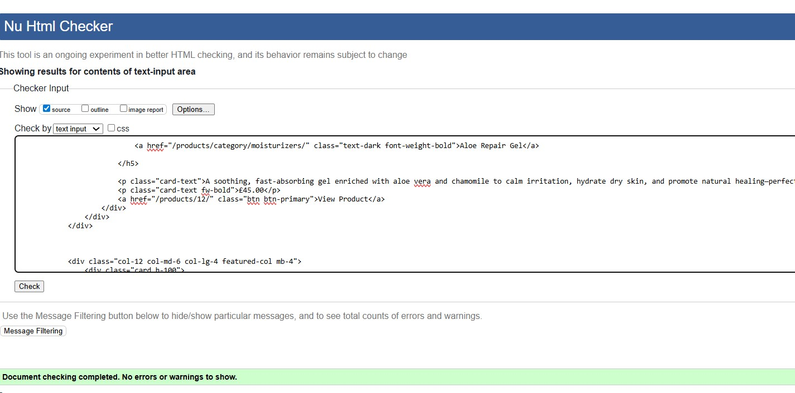

**Signup Page**  
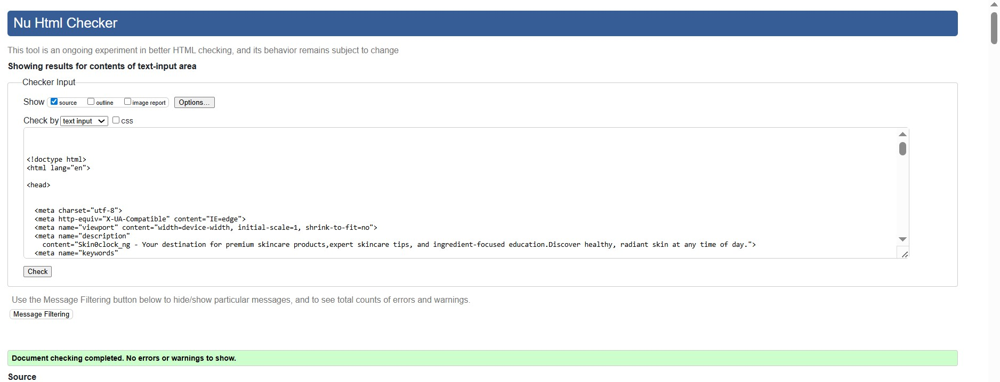

**Login Page**  
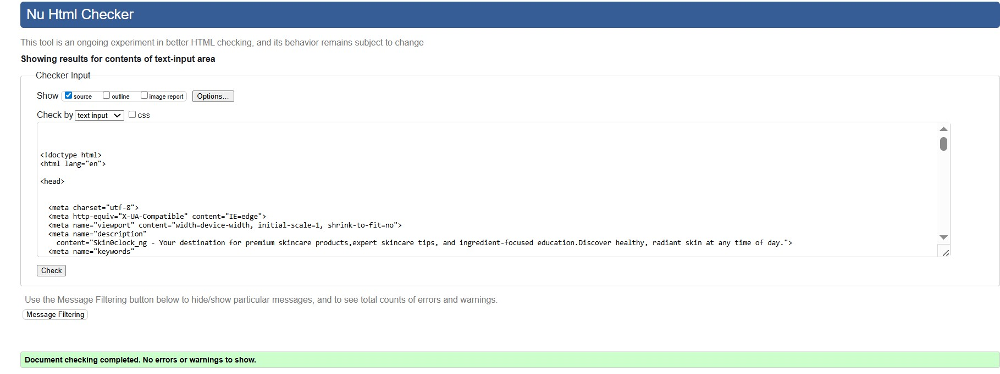

**Logout Page**  
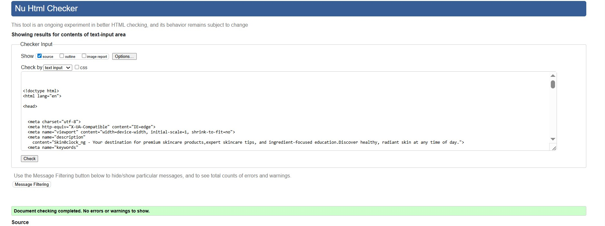

**Products Page**  
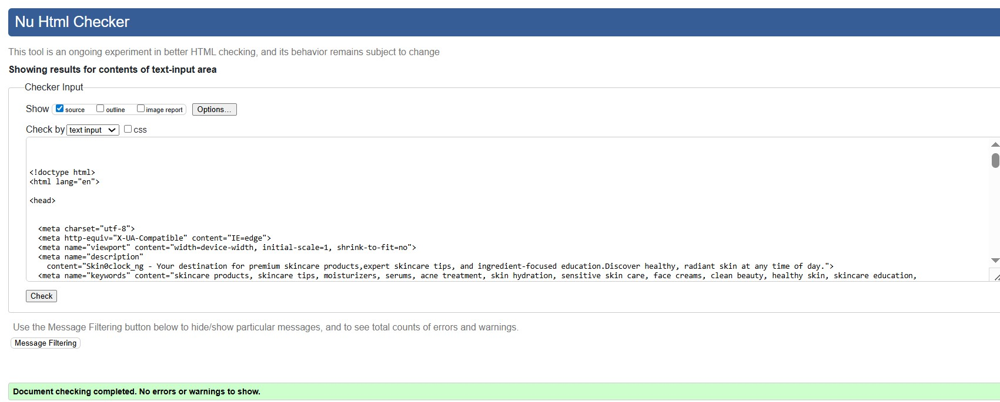

**Product Detail Page**  
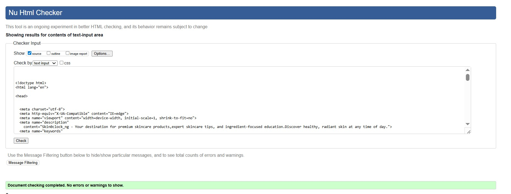

**Categories Page**  
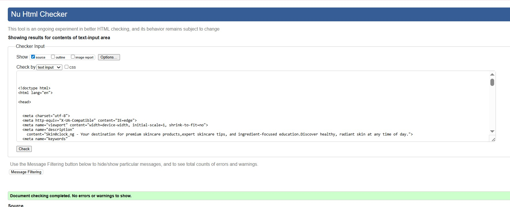

**Wishlist Page**  
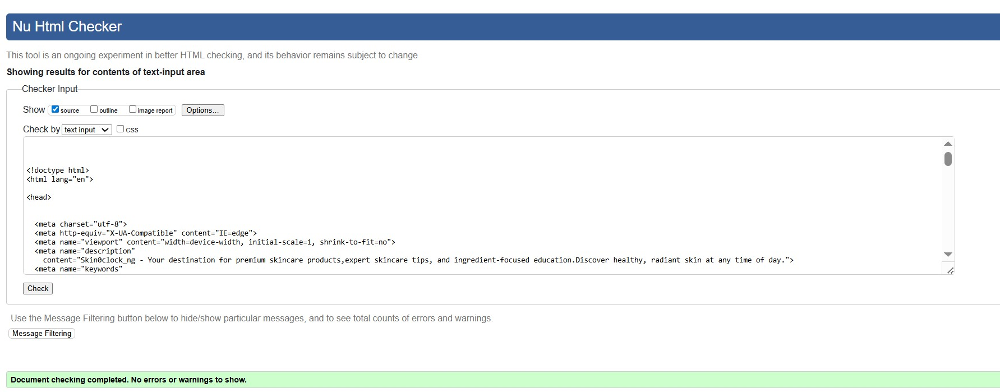

**FAQ Page**  
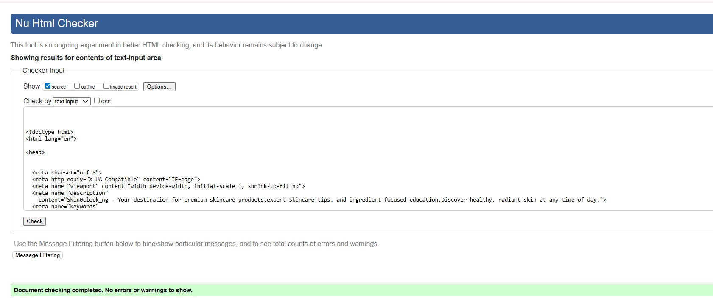

**Add to Bag Page**  

**Contact Page**  
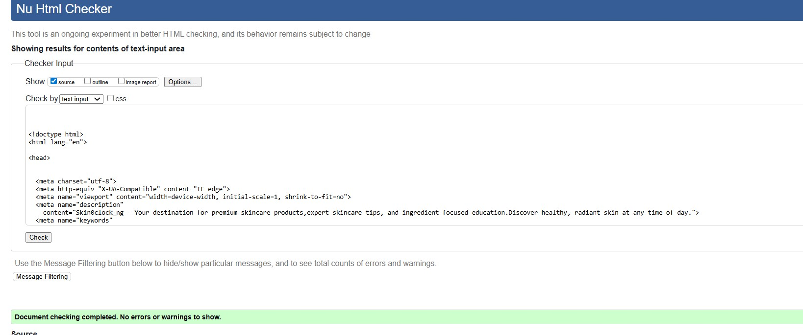

**Product Management Page**  
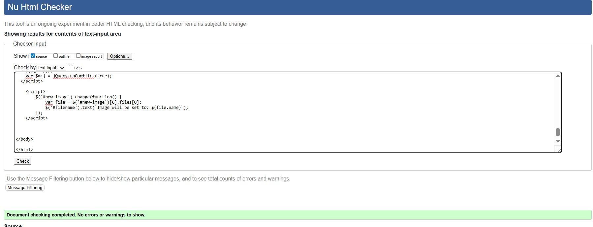

**Shopping Bag Page**  
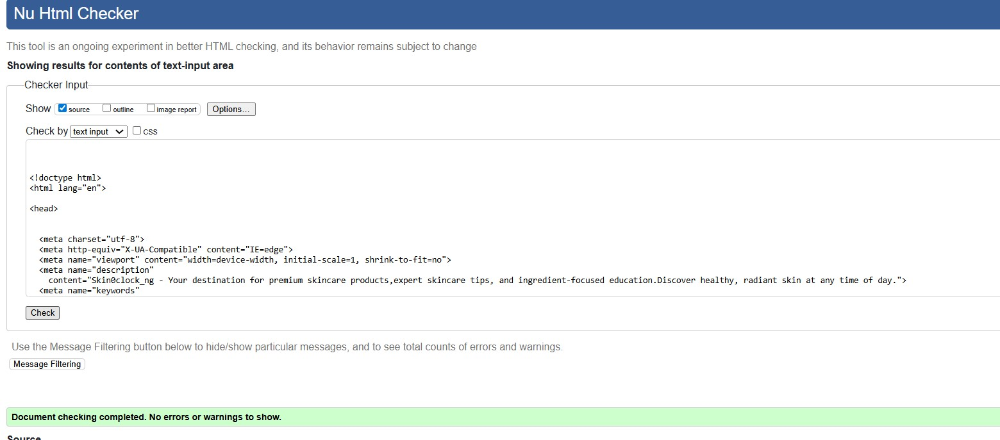

**Checkout Page**  
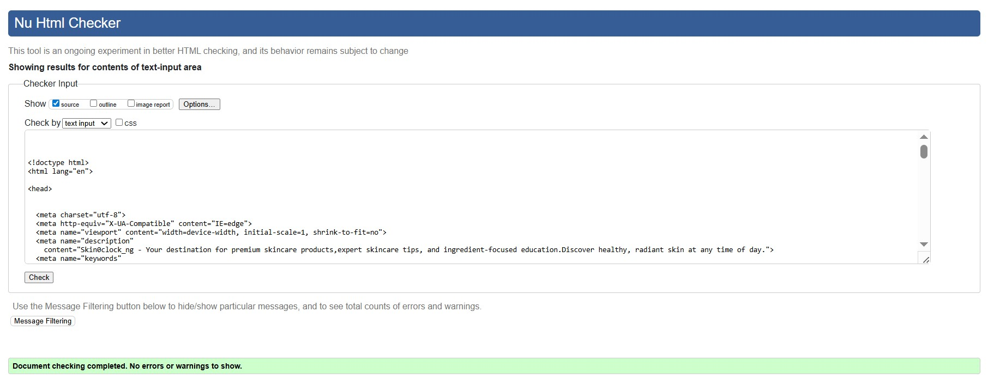

**Checkout Success Page**  

**Profile Page**  
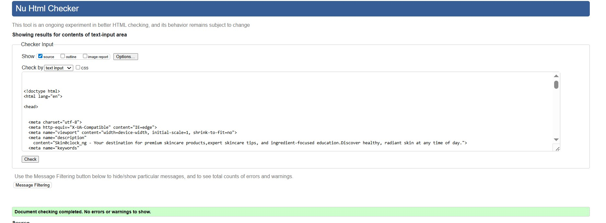

**Order History Page**  
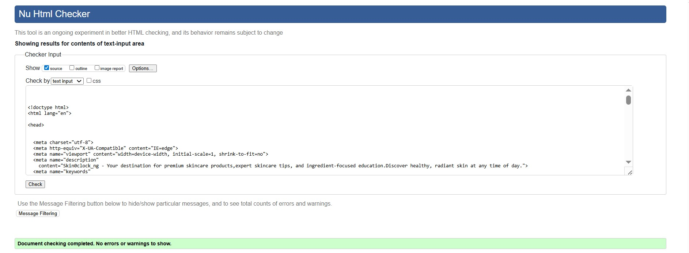

**Products & Deals Page**  
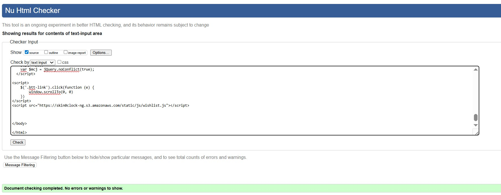

### Validation Errors

| **CSS Validation Issue** | **Description** |
|:-------------------------|:----------------|
| Invalid CSS property `text-decoration-style: none;` | `text-decoration-style` does not accept `none`; corrected |
| Invalid CSS property `font-weight: 200px;` | `font-weight 200px` is not  `a font weight value`; corrected |

### CSS Validation Corrected
Testing using the recommended [CSS Jigsaw Validator](https://jigsaw.w3.org/css-validator/) to validate all of my CSS files.
- [x] CSS validation all passed.

**base.css**  
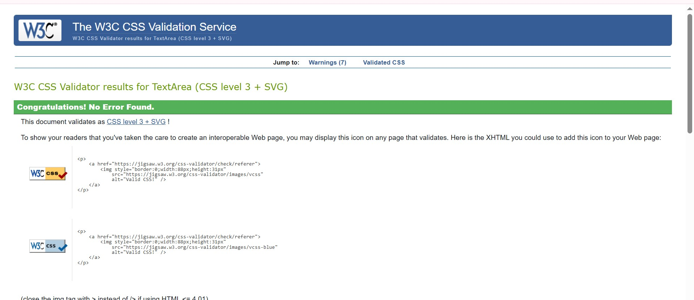

**profile.css**  
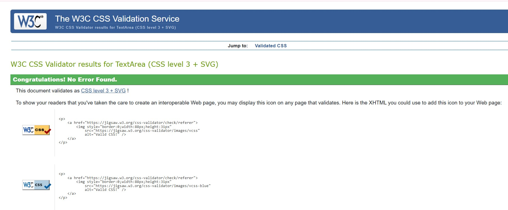

**checkout.css**  
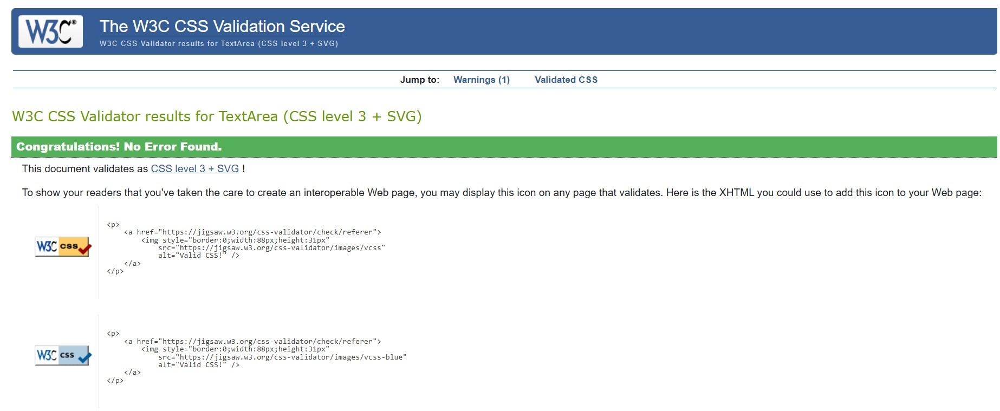

### Validation Errors

| **JavaScript Validation Issue** | **Description** |
|:---------------------------------|:----------------|
| `console` undefined | Added `/* global console */` comment to declare `console` as a global variable |

### JavaScript Validation Corrected
Testing using the recommended [JShint Validator](https://jshint.com/) to validate all of my JavaScript files.
- [x] JavaScript tests all passed.

**star-rating.js**  
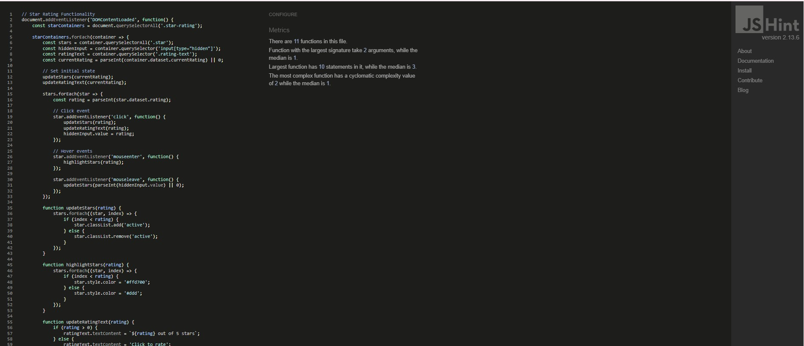

**wishlist.js**  

**countryfield.js**  
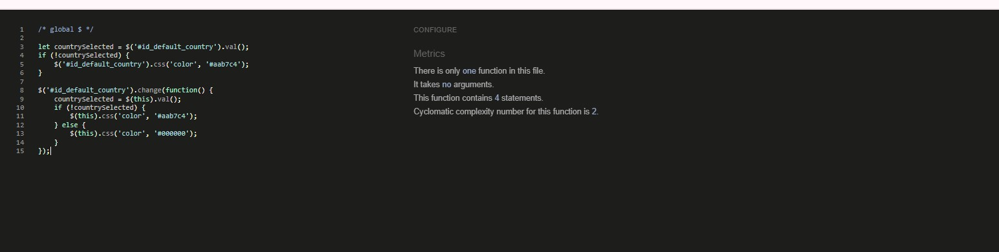

**bag.js**  
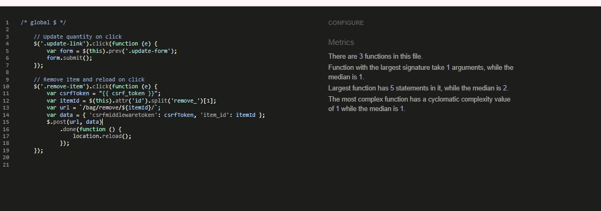

**stripe_element.js**  
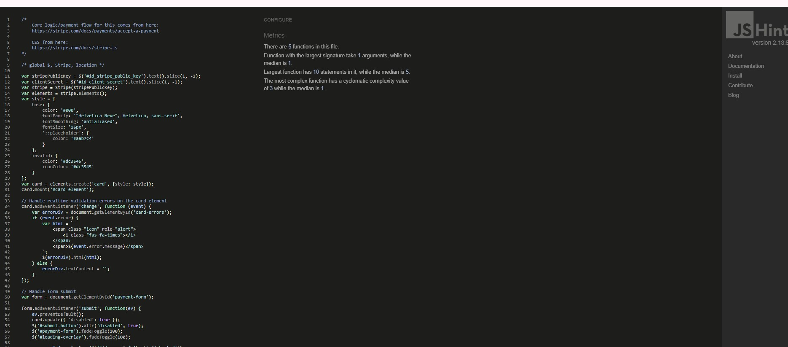

### CI Python Linter
Testing using the recommended [PEP8 CI Python Linter](https://pep8ci.herokuapp.com/) to validate all of my Python files.
- [x] Python tests all passed.

During development, code quality was maintained by following the [PEP8](https://peps.python.org/pep-0008/) style guide for Python. Errors & warnings were detected & corrected accross apps by running flake8.
    
Common issues that were identified & resolved included:
| **Issue** | **Action Taken** |
|:----------|:-----------------|
| Lines exceeding 79 characters (E501) | Broken into multiple lines for readability |
| Trailing whitespace (W291) & blank lines with whitespace (W293) | Cleaned up for clarity & consistency |
| Missing or insufficient blank lines after class or function definitions (E302, E305) | Added blank lines to improve code structure |
| Unused imports (F401) & unused variables (F841) | Removed unused code for a cleaner, efficient codebase |
| Missing newlines at end of files (W292, W391) | Added newlines to meet formatting standards |

    All Python files containing the project's code have been tested, & the errors were fixed.
    After running the CI Python Linter, it shows there are no errors.

| **Feature** | **admin.py** | **apps.py** | **models.py** | **urls.py** | **views.py** | **forms.py** | **tests.py** | 
| ----------- |:------------:|:-----------:|:-------------:|:-----------:|:------------:|:------------:|:------------:|
| skin0clock_ng | n/a | [no errors](static/documentation/testing/main-urls.jpg) | [no errors](static/documentation/testing/main-views.jpg) | n/a | n/a |
| home | n/a | [no errors](static/documentation/testing/home-apps.jpg) | n/a | [no errors](static/documentation/testing/home-urls.jpg) | [no errors](static/documentation/testing/home-views.jpg) | n/a | [no errors](static/documentation/testing/home-test.webp) |
| products | [no errors](static/documentation/testing/products-admin.jpg) | [no errors](static/documentation/testing/products-apps.jpg) | [no errors](static/documentation/testing/products-models.jpg) | [no errors](static/documentation/testing/products-urls.jpg) | [no errors](static/documentation/testing/products-views.jpg) | [no errors](static/documentation/testing/products-forms.jpg) | [no errors](static/documentation/testing/products-test.webp) |
| wishlist | [no errors](static/documentation/testing/wishlist-admin.jpg) | n/a | [no errors](static/documentation/testing/wishlist-models.jpg) | [no errors](static/documentation/testing/wishlist-urls.jpg) | [no errors](static/documentation/testing/wishlist-views.jpg) | n/a | [no errors](static/documentation/testing/wishlist-test.jpg) |
| faq | [no errors](static/documentation/testing/faq-admin.jpg) | [no errors](static/documentation/testing/faq-apps.jpg) | [no errors](static/documentation/testing/faq-models.jpg) | [no errors](static/documentation/testing/faq-urls.jpg) | [no errors](static/documentation/testing/faq-views.jpg) | n/a | [no errors](static/documentation/testing/faq-test.jpg) |
| bag | n/a | [no errors](static/documentation/testing/bag-apps.jpg) | n/a | [no errors](static/documentation/testing/bag-urls.jpg) | [no errors](static/documentation/testing/bag-views.jpg) | n/a | [no errors](static/documentation/testing/bag-test.jpg) |
| checkout | [no errors](static/documentation/testing/checkout-admin.jpg) | [no errors](static/documentation/testing/checkout-apps.jpg) | [no errors](static/documentation/testing/checkout-models.jpg) | [no errors](static/documentation/testing/checkout-urls.jpg) | [no errors](static/documentation/testing/checkout-views.jpg) | [no errors](static/documentation/testing/checkout-forms.jpg) | [no errors](static/documentation/testing/checkout-test.jpg) |
| profiles | n/a | [no errors](static/documentation/testing/profiles-apps.jpg) | [no errors](static/documentation/testing/profiles-models.jpg) | [no errors](static/documentation/testing/profiles-url.jpg) | [no errors](static/documentation/testing/profiles-views.jpg) | [no errors](static/documentation/testing/profiles-forms.jpg) | [no errors](static/documentation/testing/profiles-test.jpg) |
| review | [no errors](static/documentation/testing/review-admin.jpg) | [no errors](static/documentation/testing/review-apps.jpg) | [no errors](static/documentation/testing/review-models.jpg) | [no errors](static/documentation/testing/wishlist-urls.jpg) | [no errors](static/documentation/testing/wishlist-views.jpg) | [no errors](static/documentation/testing/review-forms.jpg) | [no errors](static/documentation/testing/review-test.jpg) |
| contact | [no errors](static/documentation/testing/contact-admin.jpg) | [no errors](static/documentation/testing/contact-apps.jpg) | [no errors](static/documentation/testing/contact-models.jpg) | [no errors](static/documentation/testing/contact-urls.jpg) | [no errors](static/documentation/testing/contact-views.jpg) | [no errors](static/documentation/testing/contact-forms.jpg) | [no errors](static/documentation/testing/contact-test.jpg) |

| **Feature** | **contexts.py** | **signals.py** | **webhook_handler.py** | **webhooks.py** | **utils.py** |
|-------------|:---------------:|:--------------:|:----------------------:|:---------------:|:-------------:|
| bag | [no errors](static/documentation/testing/bag-context.jpg) | n/a | n/a | n/a | [no errors](static/documentation/testing/bag-utils.webp)
| checkout | n/a | [no errors](static/documentation/testing/checkout-signals.jpg) | [no errors](static/documentation/testing/checkout-webhook-handler.jpg) | [no errors](static/documentation/testing/checkout-webhooks.jpg)| n/a

## Backend Testing
Automated backend testing has been implemented across all apps using Django’s built-in TestCase framework. Each app has its own test.py file containing unit & view tests. All tests are [PEP8](https://peps.python.org/pep-0008/) compliant & validate the critical functionality of models, forms, views & session handling.

__Apps tested:__
- [x] home
- [x] products
- [x] wishlist
- [x] review
- [x] faq
- [x] bag
- [x] checkout
- [x] profiles
- [x] contact

| **Testing Includes** | **Description** |
|:--------------|:----------------|
| **Model String Representations** | Tests that model `__str__` methods return correct readable strings. |
| **Form Validations** | Ensures forms validate correctly with valid & invalid inputs. |
| **View Responses & Template Rendering** | Verifies correct HTTP responses & that the correct templates are rendered. |
| **Access Control for Restricted Views** | Tests that only admins can access certain admin-only views & actions. |
| **Bag Session Behavior** | Tests session functionality for adding, adjusting & removing bag items. |
| **Checkout Process & Order Creation** | Verifies checkout flow, order saving & stock adjustments post-purchase. |
| **Stripe Webhook Handling & Order Confirmation** | Tests webhook reception, validation & updating orders after Stripe confirmation. |
| **User Profile Updates & Order History Retrieval** | Ensures users can update profiles & view past orders from their account page. |

### Running Tests

    NOTE: To run all tests across the project:
    run `python manage.py test` in console
    OR
    run `python manage.py test app_name` in console for specific app testing

- [x] **Home Test Results**  
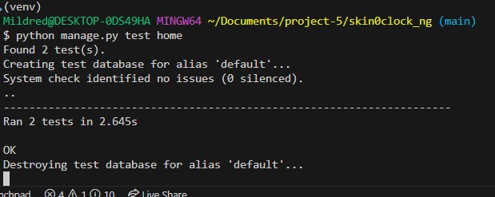

- [x] **Products Test Results**  
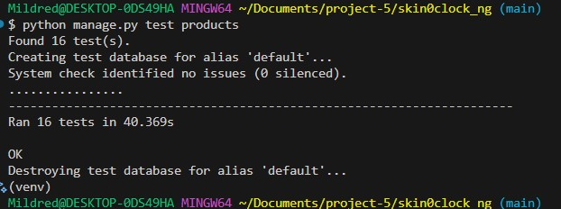

- [x] **Faq Test Results**  
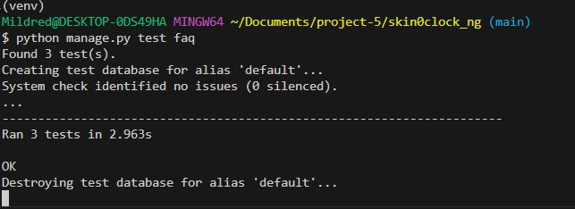

- [x] **Review Test Results**  
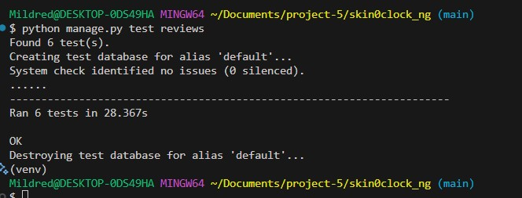

- [x] **Bag Test Results**  
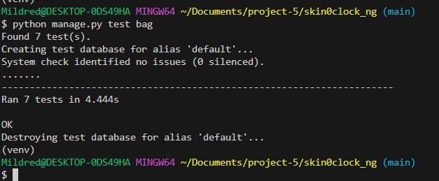

- [x] **Checkout Test Results**  
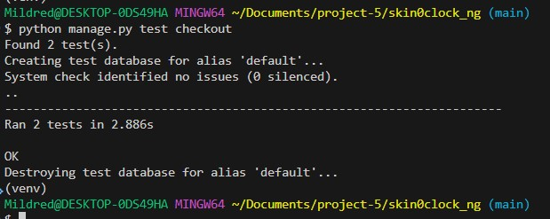

- [x] **Profiles Test Results**  
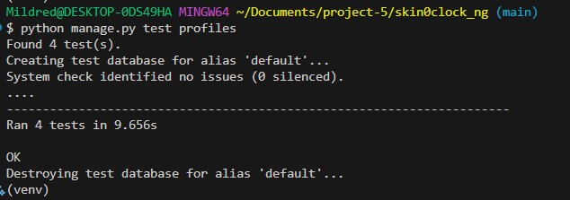

- [x] **Wishlist Test Results**  
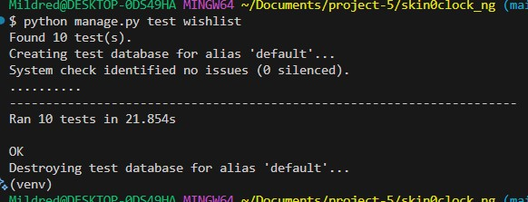

- [x] **Contact Test Results**  
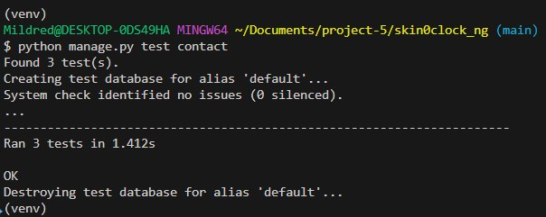

## Lighthouse Test

- [x] Desktop view:

    **Home Page**  
    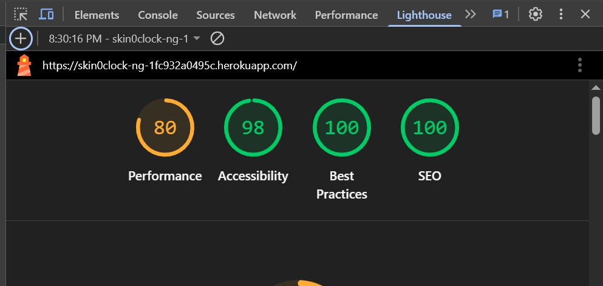

    **Products page**  
    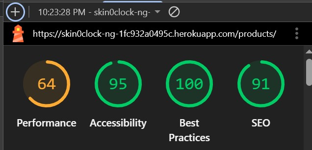

    **Faq Page**  
    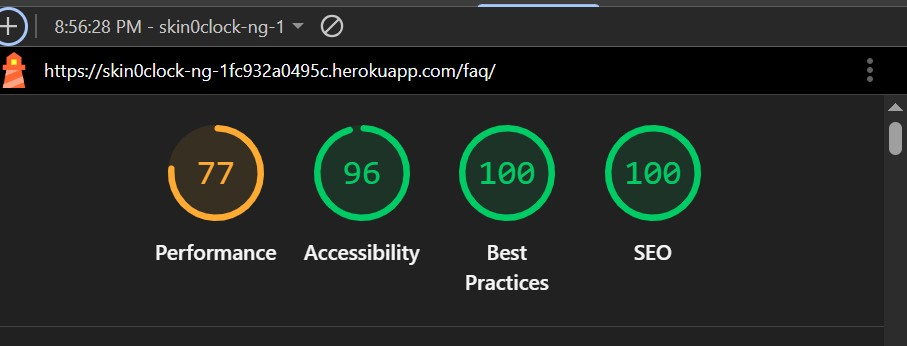

    **Wishlist Page**  
    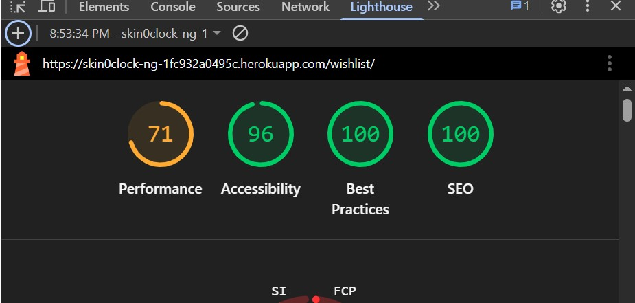

    **Bag Page**  
    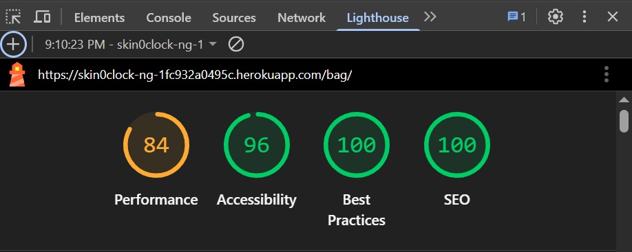

    **Checkout Page**  
    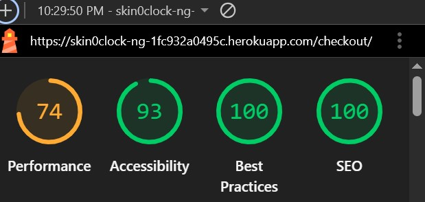

    **Profiles Page**  
    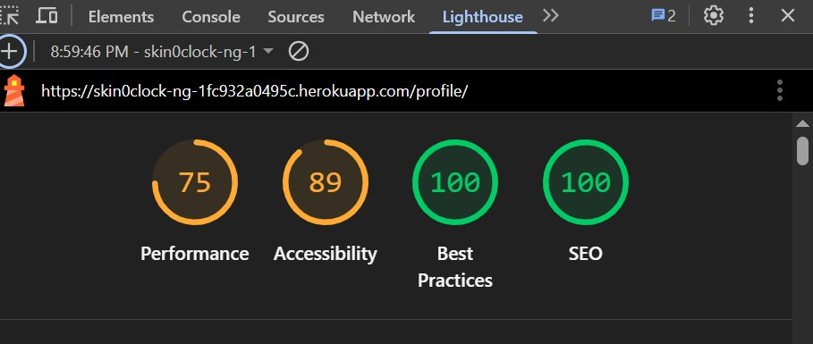

    **Signup Page**  
    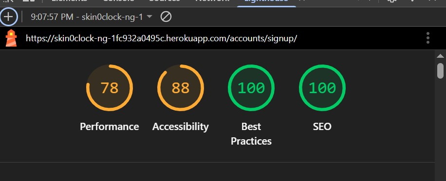

    **Login Page**  
    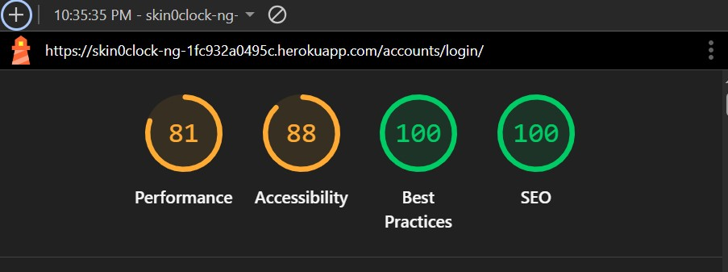

    **Logout Page**  
    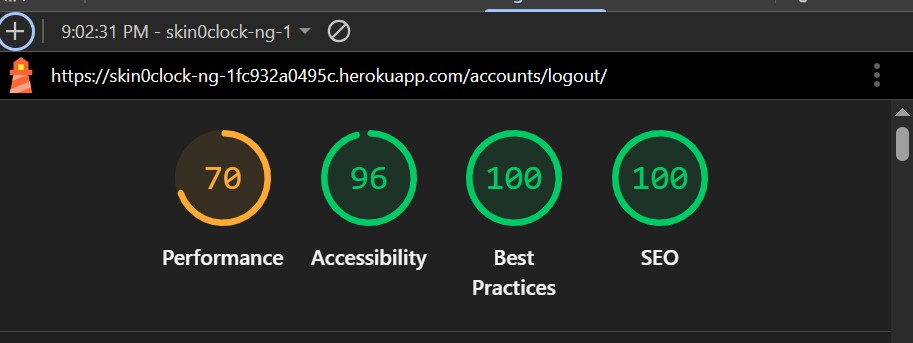

    **Contact Page**  
    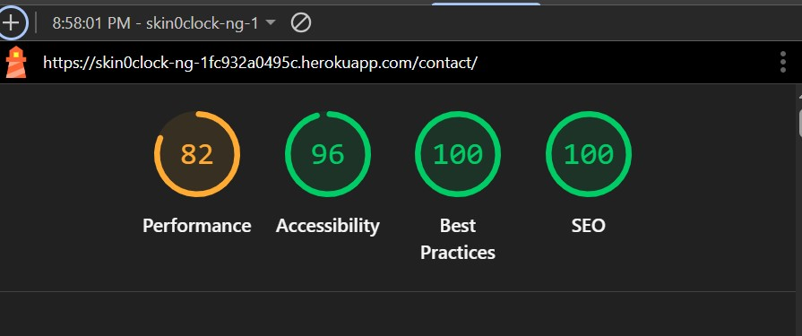

- [x] Mobile view:

    Performance was lower than preferred on mobile view due to the site being image heavy on landing page with hero & featured products. Images used in the sites design were compressed to offer the best chance for a decent performance score.

    **Mobile Home Page**  
    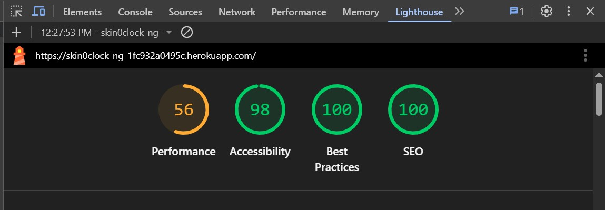

### Accessibility

Accessibility was included in every planning stage for Skin0clock_ng, through the use of the [WAVE report tool](https://wave.webaim.org/) I could ensure that any necessary changes were made to make the website as accessible as it could be.

__Accessibility Fixes__

**Accessibility Issue** | **Items Affected**  
|:----------------------|:------------------|  
| Missing `<h1>` heading | Homepage lacked a semantic first-level heading  
| Missing form labels | Search bar, mobile search input  
| Empty button (icon-only) | Search button with magnifying glass icon  
| Multiple label methods | Search input had both `aria-label` and `placeholder`  
| Skipped heading levels | Product details, homepage feature sections  
| Low color contrast | Buttons, navbar toggler icon, footer text  
| Icon-only links/buttons | Wishlist icon, Delete (trash) icon in bag page  
| Navbar toggler low visibility | Toggler bars on mobile view lacked contrast  
| Incorrect Bootstrap class usage | Navbar alignment (`ms-auto` instead of `ml-auto` in Bootstrap 4)  
| Duplicate input IDs | Multiple fields with `id="search"` across templates  
| Honeypot field without accessible name | Mailchimp newsletter input for bot protection  

    All errors were resolved successfully.

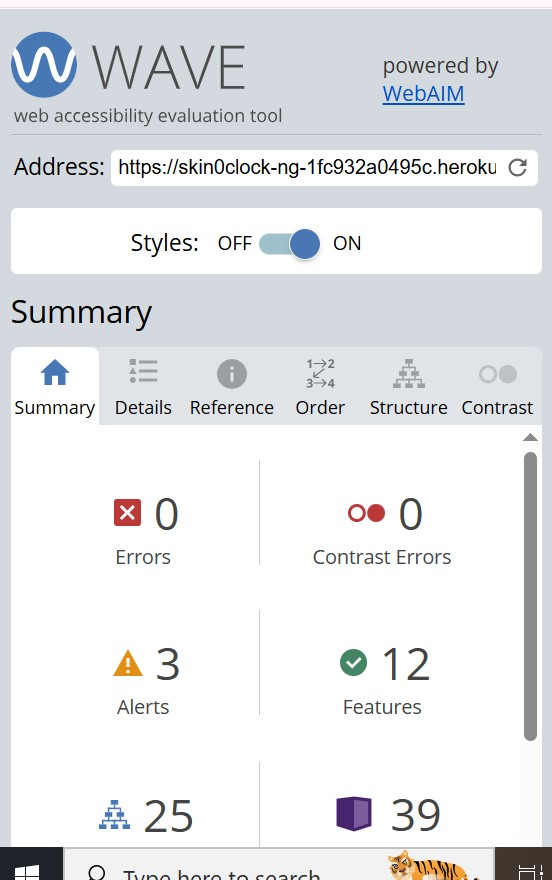

## Testing Stripe Integration

### Core Functionalities Tested

**Secure Payment Processing**
- [x] Confirmed Stripe securely processes payments without sensitive payment data touching the application's servers.
- [x] Verified correct Stripe test mode operation with test credit card numbers.

**Webhook Notifications:**
- [x] Ensured real-time webhook events from Stripe trigger immediate & accurate responses within the application.
- [x] Validated appropriate webhook events (`payment_intent.created`, `payment_intent.succeeded`, `charge.succeeded`, `charge.updated`) correctly trigger order creation or updates.

**Idempotent Payment Handling:**
- [x] Tested handling duplicate webhook events to confirm no duplicated orders or redundant email notifications occur.
- [x] Ensured application logic gracefully handles repeated webhook events without side effects.

**Order Creation & Updating:**
- [x] Verified that successful payment events (`payment_intent.succeeded`, `charge.succeeded`) automatically create & update orders accurately.
- [x] Checked database integrity & consistency of order records following webhook processing.

### Stripe Webhook Events Tested

| Webhook Event | Purpose & Test Outcome |
|---------------|--------------------------|
| `payment_intent.created`| Successfully initiated payment intent recorded |
| `payment_intent.succeeded`| Correct order creation & confirmation emails sent |
| `charge.succeeded`| Order payment status updated, inventory adjusted |
| `charge.updated`| Order adjustments verified following charge updates (refunds, disputes) |

## Manual Testing

### User Input / Form Validation

Testing was carried out on desktop & mobile using multiple browsers to ensure consistent functionality, form inputs & data processing across different user environments.   

**Browsers tested:**
- [x] Chrome – primary testing environment
- [x] Firefox
- [x] Safari (macOS)

| **No.** | **Test Input** | **Correct Outcome** | **Meet Requirements** |
|:-------:|:---------------|:--------------------|:----------------------|
| 1 | Navbar Logo & Icons | PASS | Logo links to home. Navbar links (Home, Products, Categories, Faq, Wishlist, Contact) works. Mobile menu functions correctly. |
| 2 | Login Link | PASS | Clicking 'Login' in navbar redirects to login page. |
| 3 | Log into Account | PASS | Login form includes username and password. Validation triggers for empty fields. Success message appears after login. |
| 4 | Register Link | PASS | Clicking 'Register' takes user to account registration form. |
| 5 | Register Account | PASS | Registration includes username, email (optional), password fields with validation. Shows success confirmation. |
| 6 | Home Page 'Shop Now' | PASS | 'Shop Now' CTA button on homepage redirects user to the products page. |
| 7 | Product Category Links | PASS | Category filters load correct product listings (e.g., Cleansers, Serums, Moisturizers). |
| 8 | Contact Page Link | PASS | 'Contact' page loads with form for name, email, and message. |
| 9 | Logout | PASS | Clicking 'Logout' logs user out and displays a success message. |
| 10 | Social Links | PASS | Footer social icons link to respective platforms and open in new tabs. |
| 11 | Add Product to Bag | PASS | Product detail page allows quantity selection and adds to bag with success toast. |
| 12 | View Bag Page | PASS | Clicking bag icon or 'View Bag' link displays current contents with quantity, subtotal, and total. |
| 13 | Update Quantity in Bag | PASS | Quantity field allows updates. Subtotal and total values recalculate dynamically. |
| 14 | Remove Item from Bag | PASS | Trash icon removes item and updates bag totals. Shows confirmation message. |
| 15 | Proceed to Checkout | PASS | 'Secure Checkout' button leads to checkout page with order summary. |
| 16 | Checkout Form Validation | PASS | Required fields (name, address, postcode, email) must be filled. Email requires correct format. |
| 17 | Payment Card Input | PASS | Stripe fields load for card number, expiry date, and CVC. Only valid formats accepted. |
| 18 | Place Order with Valid Card | PASS | Stripe test card processes payment, redirects to success page, and sends confirmation email. |
| 19 | Place Order with Invalid Card | PASS | Invalid card number causes payment failure. User is notified and can retry. |
| 20 | Place Order with Insufficient Funds Card | PASS | Using insufficient funds card shows payment error. Bag remains intact for retry. |
| 21 | Order Confirmation Page | PASS | Confirmation page displays order number, email, and bag summary. |
| 22 | Order History in Profile | PASS | Logged-in users can access profile to view past orders, including order date, products, and totals. |
| 23 | Checkout Save Info Toggle | PASS | Option to save delivery info for future checkouts works for logged-in users. |
| 24 | Save Cart on Logout & Restore on Login | PASS | Bag contents are preserved for logged-in users who logout and return later. |
| 25 | Contact Form Submission | PASS | Form validates required fields. Empty fields or invalid email trigger errors. Success message appears on valid submission. |
| 26 | Footer Subscribe Form | PASS | Email newsletter form validates input. Success message shown for valid email. Errors appear for blank or invalid submissions. |
| 27 | Stock Adjustment After Checkout | PASS | Product stock is updated after checkout. No over-selling allowed. |

## Bugs Encountered 
  
The below are bugs that I spent more time investigating, most of these encountered were learning curves. 

| **Bug No.** | **Description** | **Fix Status** | **Solution Implemented** | **Source of Bug** |
|-------------|-----------------|----------------|---------------------------|-------------------|
| 001 | Navbar toggler misaligned and icon color too light |  Fixed | Adjusted `margin-left` and replaced default Bootstrap toggler SVG with darker stroke | UI inconsistency with theme |
| 002 | Missing form labels on newsletter and quantity inputs |  Fixed | Added `aria-label` and `<label for="">` associations | Accessibility testing |
| 003 | Duplicate input IDs (`email`) in forms |  Fixed | Made all input IDs unique | Manual HTML inspection |
| 004 | Hidden honeypot input missing accessible name |  Fixed | Added `aria-hidden="true"` and `tabindex="-1"` to honeypot field | Mailchimp embed snippet |
| 005 | Improper Bootstrap class usage (`ms-auto` in Bootstrap 4 site) |  Fixed | Replaced with `ml-auto` (Bootstrap 4 compatible) | Template inheritance |
| 006 | Buttons and links with insufficient color contrast |  Fixed | Updated colors to meet WCAG contrast ratio guidelines | Lighthouse audit |
| 007 | Wishlist heart icon not toggling active state visually |  Fixed | Added `aria-pressed` state and visual class toggling on click | JS logic in wishlist.js |
| 008 | FAQ toggle buttons not accessible by keyboard |  Fixed | Converted from `
` to `<button>` and added `aria-expanded` attributes | Manual keyboard test |
| 009 | Review submission form not announcing success to screen readers |  Fixed | Added `role="status"` live region to toast message container | Accessibility improvement |