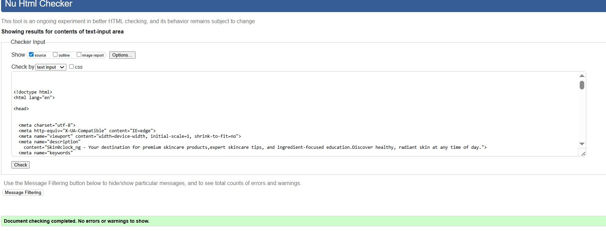
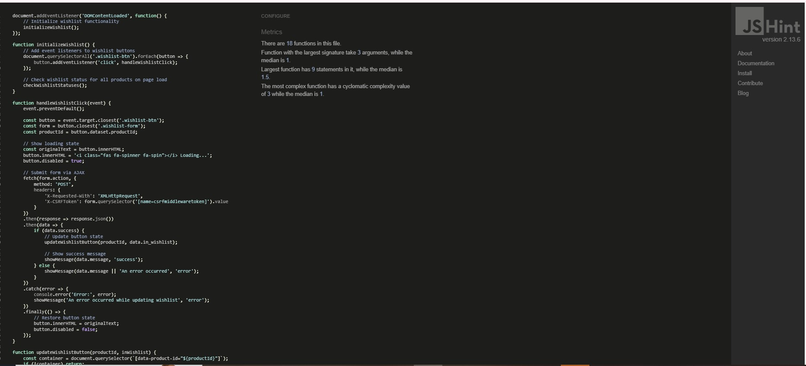

# Testing

Testing file for skin0clock_ng [README.md](README.md).

## Testing User Stories

### Developer Stories

- [x] Frontend & Backend of the project created.
- [x] Database is connected to the project.
- [x] App deployed on Heroku.

### User Stories

- [x] Register an account
- [x] Login & logout of account
- [x] Manage user accounts
- [x] View all skincare products
- [x] View products details individually
- [x] Add featured items
- [x] Persistent access to shopping basket
- [x] Update items in cart
- [x] Integrate stripe for payment
- [x] Order summary display
- [x] Order management
- [x] Writing a review
- [ ] Add items to wishlist
- [ ] Faq for questions and informative answers
- [ ] Subscribe to newsletter
- [x] Social media profile
- [x] Optimize with Google SEO

## Validation

### Validation Errors

| **HTML Validation Issue** | **Description** |
|:---------------------------|:----------------|
| Duplicate attribute `rel` on `<link>` tags | Multiple `rel` attributes found on the same `<link>` element |
| Missing `type="button"` on non-form `<button>` | Buttons not inside forms should explicitly declare `type="button"` |
| Using `
` directly inside a `<ul>` | Invalid HTML structure; `<ul>` should only contain `<li>` elements |
| Button missing `type="submit"` | Form submit buttons missing an explicit `type="submit"` attribute |
| Empty `<a href="">` if no image exists | Empty anchor tags if an image is missing from inside the link |
| `
` inside `<strong>` not valid | Block-level `
` tags incorrectly placed inside inline `<strong>` tags |
| No `alt` fallback if `product.image` is missing | Missing descriptive text for images when `product.image` is not available |
| Empty `

` | Empty `
` without meaningful content |
| Missing closing `
` for button container | Unclosed `
` leading to HTML structure errors |
| No `<label>` explicitly for form fields | Form inputs missing associated `<label>` elements |
| Empty ` ` tag inside `
` | Improper use of empty ` ` tag within a paragraph |
| Misplaced closing `
` | Closing a `
` tag at the wrong location, breaking layout |
| Trailing slash on void elements | Unnecessary trailing `/` on self-closing tags in HTML5 |
| No `
` element in scope but a `
` end tag | `
` tag used without an open `
` tag |
| Stray end tag `
` | Extra or misplaced `
` without a matching open tag |

### HTML Validation Corrected
Testing using the recommended [HTML W3C Validator](https://validator.w3.org/) to validate all of my HTML files.
- [x] HTML validation all passed:

**Home page**  

**Signup Page**  

**Login Page**  

**Logout Page**  

**Products Page**  

**Product Detail Page**  

**Categories Page**  

**Wishlist Page**  

**FAQ Page**  

**Add to Bag Page**  

**Contact Page**  

**Product Management Page**  

**Shopping Bag Page**  

**Checkout Page**  

**Checkout Success Page**  

**Profile Page**  

**Order History Page**  

**Products & Deals Page**  

### Validation Errors

| **CSS Validation Issue** | **Description** |
|:-------------------------|:----------------|
| Invalid CSS property `text-decoration-style: none;` | `text-decoration-style` does not accept `none`; corrected |
| Invalid CSS property `font-weight: 200px;` | `font-weight 200px` is not  `a font weight value`; corrected |

### CSS Validation Corrected
Testing using the recommended [CSS Jigsaw Validator](https://jigsaw.w3.org/css-validator/) to validate all of my CSS files.
- [x] CSS validation all passed.

**base.css**  

**profile.css**  

**checkout.css**  

### Validation Errors

| **JavaScript Validation Issue** | **Description** |
|:---------------------------------|:----------------|
| `console` undefined | Added `/* global console */` comment to declare `console` as a global variable |

### JavaScript Validation Corrected
Testing using the recommended [JShint Validator](https://jshint.com/) to validate all of my JavaScript files.
- [x] JavaScript tests all passed.

**star-rating.js**  

**wishlist.js**  

**countryfield.js**  

**bag.js**  

**stripe_element.js**  

### CI Python Linter
Testing using the recommended [PEP8 CI Python Linter](https://pep8ci.herokuapp.com/) to validate all of my Python files.
- [x] Python tests all passed.

During development, code quality was maintained by following the [PEP8](https://peps.python.org/pep-0008/) style guide for Python. Errors & warnings were detected & corrected accross apps by running flake8.
    
Common issues that were identified & resolved included:
| **Issue** | **Action Taken** |
|:----------|:-----------------|
| Lines exceeding 79 characters (E501) | Broken into multiple lines for readability |
| Trailing whitespace (W291) & blank lines with whitespace (W293) | Cleaned up for clarity & consistency |
| Missing or insufficient blank lines after class or function definitions (E302, E305) | Added blank lines to improve code structure |
| Unused imports (F401) & unused variables (F841) | Removed unused code for a cleaner, efficient codebase |
| Missing newlines at end of files (W292, W391) | Added newlines to meet formatting standards |

    All Python files containing the project's code have been tested, & the errors were fixed.
    After running the CI Python Linter, it shows there are no errors.

| **Feature** | **admin.py** | **apps.py** | **models.py** | **urls.py** | **views.py** | **forms.py** | **tests.py** | 
| ----------- |:------------:|:-----------:|:-------------:|:-----------:|:------------:|:------------:|:------------:|
| skin0clock_ng | n/a | [no errors](static/documentation/testing/main-urls.jpg) | [no errors](static/documentation/testing/main-views.jpg) | n/a | n/a |
| home | n/a | [no errors](static/documentation/testing/home-apps.jpg) | n/a | [no errors](static/documentation/testing/home-urls.jpg) | [no errors](static/documentation/testing/home-views.jpg) | n/a | [no errors](static/documentation/testing/home-test.webp) |
| products | [no errors](static/documentation/testing/products-admin.jpg) | [no errors](static/documentation/testing/products-apps.jpg) | [no errors](static/documentation/testing/products-models.jpg) | [no errors](static/documentation/testing/products-urls.jpg) | [no errors](static/documentation/testing/products-views.jpg) | [no errors](static/documentation/testing/products-forms.jpg) | [no errors](static/documentation/testing/products-test.webp) |
| wishlist | [no errors](static/documentation/testing/wishlist-admin.jpg) | n/a | [no errors](static/documentation/testing/wishlist-models.jpg) | [no errors](static/documentation/testing/wishlist-urls.jpg) | [no errors](static/documentation/testing/wishlist-views.jpg) | n/a | [no errors](static/documentation/testing/wishlist-test.jpg) |
| faq | [no errors](static/documentation/testing/faq-admin.jpg) | [no errors](static/documentation/testing/faq-apps.jpg) | [no errors](static/documentation/testing/faq-models.jpg) | [no errors](static/documentation/testing/faq-urls.jpg) | [no errors](static/documentation/testing/faq-views.jpg) | n/a | [no errors](static/documentation/testing/faq-test.jpg) |
| bag | n/a | [no errors](static/documentation/testing/bag-apps.jpg) | n/a | [no errors](static/documentation/testing/bag-urls.jpg) | [no errors](static/documentation/testing/bag-views.jpg) | n/a | [no errors](static/documentation/testing/bag-test.jpg) |
| checkout | [no errors](static/documentation/testing/checkout-admin.jpg) | [no errors](static/documentation/testing/checkout-apps.jpg) | [no errors](static/documentation/testing/checkout-models.jpg) | [no errors](static/documentation/testing/checkout-urls.jpg) | [no errors](static/documentation/testing/checkout-views.jpg) | [no errors](static/documentation/testing/checkout-forms.jpg) | [no errors](static/documentation/testing/checkout-test.jpg) |
| profiles | n/a | [no errors](static/documentation/testing/profiles-apps.jpg) | [no errors](static/documentation/testing/profiles-models.jpg) | [no errors](static/documentation/testing/profiles-url.jpg) | [no errors](static/documentation/testing/profiles-views.jpg) | [no errors](static/documentation/testing/profiles-forms.jpg) | [no errors](static/documentation/testing/profiles-test.jpg) |
| review | [no errors](static/documentation/testing/review-admin.jpg) | [no errors](static/documentation/testing/review-apps.jpg) | [no errors](static/documentation/testing/review-models.jpg) | [no errors](static/documentation/testing/wishlist-urls.jpg) | [no errors](static/documentation/testing/wishlist-views.jpg) | [no errors](static/documentation/testing/review-forms.jpg) | [no errors](static/documentation/testing/review-test.jpg) |
| contact | [no errors](static/documentation/testing/contact-admin.jpg) | [no errors](static/documentation/testing/contact-apps.jpg) | [no errors](static/documentation/testing/contact-models.jpg) | [no errors](static/documentation/testing/contact-urls.jpg) | [no errors](static/documentation/testing/contact-views.jpg) | [no errors](static/documentation/testing/contact-forms.jpg) | [no errors](static/documentation/testing/contact-test.jpg) |

| **Feature** | **contexts.py** | **signals.py** | **webhook_handler.py** | **webhooks.py** | **utils.py** |
|-------------|:---------------:|:--------------:|:----------------------:|:---------------:|:-------------:|
| bag | [no errors](static/documentation/testing/bag-context.jpg) | n/a | n/a | n/a | [no errors](static/documentation/testing/bag-utils.webp)
| checkout | n/a | [no errors](static/documentation/testing/checkout-signals.jpg) | [no errors](static/documentation/testing/checkout-webhook-handler.jpg) | [no errors](static/documentation/testing/checkout-webhooks.jpg)| n/a

## Backend Testing
Automated backend testing has been implemented across all apps using Django’s built-in TestCase framework. Each app has its own test.py file containing unit & view tests. All tests are [PEP8](https://peps.python.org/pep-0008/) compliant & validate the critical functionality of models, forms, views & session handling.

__Apps tested:__
- [x] home
- [x] products
- [x] wishlist
- [x] review
- [ ] faq
- [x] bag
- [x] checkout
- [x] profiles
- [x] contact

| **Testing Includes** | **Description** |
|:--------------|:----------------|
| **Model String Representations** | Tests that model `__str__` methods return correct readable strings. |
| **Form Validations** | Ensures forms validate correctly with valid & invalid inputs. |
| **View Responses & Template Rendering** | Verifies correct HTTP responses & that the correct templates are rendered. |
| **Access Control for Restricted Views** | Tests that only admins can access certain admin-only views & actions. |
| **Bag Session Behavior** | Tests session functionality for adding, adjusting & removing bag items. |
| **Checkout Process & Order Creation** | Verifies checkout flow, order saving & stock adjustments post-purchase. |
| **Stripe Webhook Handling & Order Confirmation** | Tests webhook reception, validation & updating orders after Stripe confirmation. |
| **User Profile Updates & Order History Retrieval** | Ensures users can update profiles & view past orders from their account page. |

### Running Tests

    NOTE: To run all tests across the project:
    run `python manage.py test` in console
    OR
    run `python manage.py test app_name` in console for specific app testing

- [x] **Home Test Results**  

- [x] **Products Test Results**  

- [x] **Faq Test Results**  

- [x] **Review Test Results**  

- [x] **Bag Test Results**  

- [x] **Checkout Test Results**  

- [x] **Profiles Test Results**  

- [x] **Wishlist Test Results**  

- [x] **Contact Test Results**  

## Lighthouse Test

- [x] Desktop view:

    **Home Page**  
    

    **Products page**  
    

    **Faq Page**  
    

    **Wishlist Page**  
    

    **Bag Page**  
    

    **Checkout Page**  
    

    **Profiles Page**  
    

    **Signup Page**  
    

    **Login Page**  
    

    **Logout Page**  
    

    **Contact Page**  
    

- [x] Mobile view:

    Performance was lower than preferred on mobile view due to the site being image heavy on landing page with hero & featured products. Images used in the sites design were compressed to offer the best chance for a decent performance score.

    **Mobile Home Page**  
    
